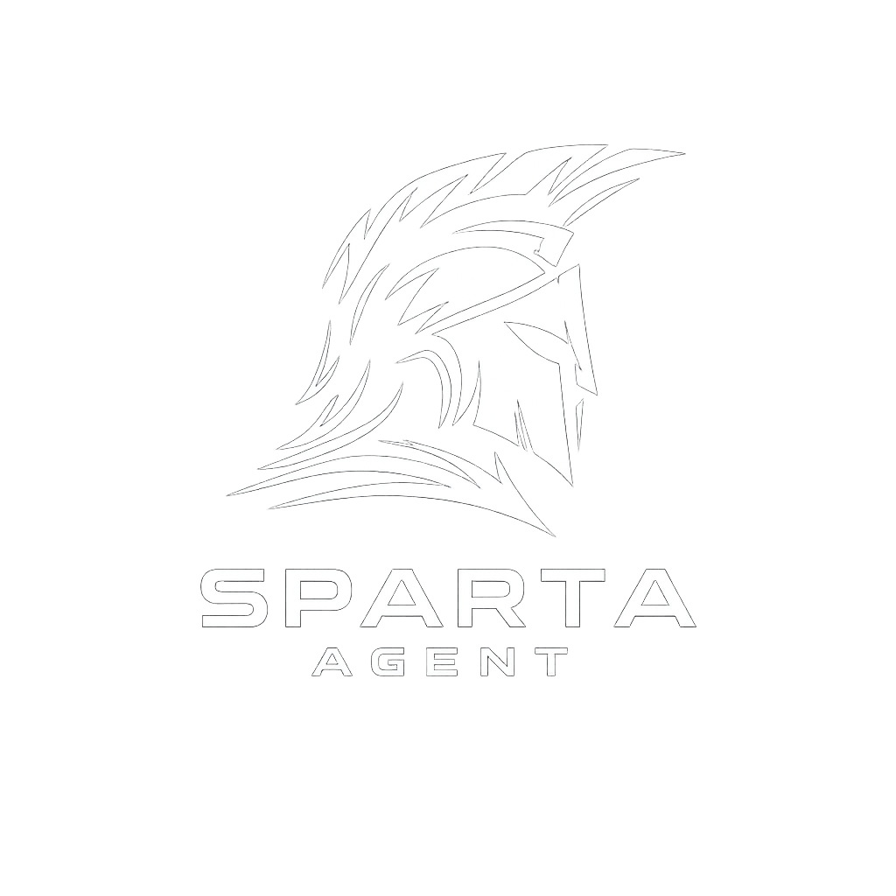

<div align="center">
  
  <h1>Sparta Agent</h1>
  <p><strong>Plataforma de Desarrollo Agéntica Local-First para Equipos de Ingeniería de Alto Rendimiento</strong></p>
  <p>
    
    
    
    
    
    
    
  </p>
</div>

---

## 🏢 Propuesta de Valor y Caso de Negocio

En la era de la inteligencia artificial, la productividad de los equipos de desarrollo está limitada por las herramientas de autocompletado pasivo. **Sparta Agent** redefine este paradigma al ofrecer un **IDE agéntico autónomo y local-first**. 

Nuestra filosofía de diseño resuelve los tres desafíos fundamentales que enfrentan los CTOs y directores de tecnología al adoptar asistentes de codificación basados en IA:

### 1. Protección de Propiedad Intelectual y Cumplimiento (Compliance)
La mayoría de las herramientas comerciales transmiten código fuente confidencial a nubes de terceros sin garantías robustas de privacidad. Sparta Agent procesa la estructura del espacio de trabajo y ejecuta el análisis de código de manera **local-first**. Los datos confidenciales permanecen dentro del perímetro de seguridad corporativo, cumpliendo con regulaciones estrictas como GDPR, CCPA y normativas bancarias.

### 2. Eficiencia de Costos y Flexibilidad de Modelos
El uso indiscriminado de APIs comerciales de gran tamaño genera una facturación de tokens impredecible. Mediante nuestra capa de abstracción de proveedores, Sparta Agent permite alternar dinámicamente entre modelos locales de código abierto (como Llama 3 u Ollama) para tareas rutinarias, y modelos cloud premium (como Anthropic o Gemini) para resolver problemas arquitectónicos complejos, reduciendo el Costo Total de Propiedad (TCO) hasta en un 70%.

### 3. Autonomía Real frente a Copilotos Pasivos
A diferencia de las extensiones tradicionales de autocompletado que sugieren código línea por línea, Sparta Agent opera como un **miembro de equipo autónomo**. Utiliza ciclos estructurados de planificación, ejecución y reflexión. Al recibir un objetivo de negocio o una descripción de tarea, el agente elabora un plan estructurado, verifica errores mediante diagnósticos nativos, ejecuta comandos en entornos aislados y entrega soluciones listas para producción.

---

## 🛠️ Pilares Fundamentales del Producto

### 📋 Planificación Transparente (`create_plan`)
El agente no opera "a ciegas". Cada ejecución inicia con la llamada a la herramienta `create_plan`. Esto obliga al modelo de lenguaje a definir una secuencia lógica de pasos antes de modificar código. El usuario visualiza este plan en tiempo real y puede intervenir en el flujo de ejecución en cualquier momento.

### 🔒 Sandbox de Ejecución y Broker de Permisos
Toda acción potencialmente destructiva (como la eliminación de archivos, ejecución de comandos fuera del espacio de trabajo o instalación de dependencias externas) es interceptada por un broker de seguridad nativo escrito en Rust. Dependiendo de la política de autonomía configurada (`Siempre preguntar` o `Autónomo`), el sistema bloquea, solicita aprobación explícita al desarrollador o ejecuta comandos en entornos aislados (Docker).

### 🚀 Diagnósticos e Inspección Continua
El agente integra herramientas de diagnóstico nativo que auditan automáticamente el código tras realizar cambios. Detecta errores sintácticos y de tipado ejecutando herramientas estándar de la industria (`tsc`, `eslint`, `ruff`, `mypy`, `cargo`, `go vet`) antes de proponer cambios al usuario. Esto previene la introducción de bugs en ramas de producción.

### 📂 Ecosistema MCP (Model Context Protocol)
Gracias a la integración del estándar MCP oficial, el agente puede expandir sus capacidades conectándose a bases de datos corporativas, sistemas de tickets, herramientas de comunicación y servicios en la nube a través de conectores stdio e HTTP preconfigurados o personalizados.

---

## ⚙️ Arquitectura Conceptual del Sistema

Sparta Agent está estructurado bajo una **arquitectura desacoplada de tres capas**, garantizando alta disponibilidad, escalabilidad horizontal y facilidad de integración con infraestructura existente:

```
┌─────────────────────────────────────────────────────────────────────┐
│ 1. CAPA DE PRESENTACIÓN (React / Monaco Editor / xterm.js)         │
│ Interfaz de usuario interactiva y optimizada para la visualización   │
│ de planes de ejecución, diffs de código y consola en vivo.          │
└───────────────────────────┬─────────────────────────────────────────┘
                            │ Comunicación IPC (Desktop) / WebSockets (Cloud)
┌───────────────────────────┴─────────────────────────────────────────┐
│ 2. CAPA DE ORQUESTACIÓN (Electron Main / FastAPI)                  │
│ Puente de comunicación seguro que implementa el broker de permisos, │
│ el vault cifrado de API keys y la gestión de procesos nativos.      │
└───────────────────────────┬─────────────────────────────────────────┘
                            │ Protocolo de Comunicación JSON-RPC
┌───────────────────────────┴─────────────────────────────────────────┐
│ 3. NÚCLEO DE INTELIGENCIA (Python Engine & LangGraph Core)          │
│ Motor de razonamiento basado en grafos de estado. Gestiona el ciclo │
│ de Plan-Reflect-Act, memoria vectorial y ejecución de herramientas. │
└─────────────────────────────────────────────────────────────────────┘
```

---

## 🛡️ Seguridad por Diseño (Security Matrix)

La seguridad no es una característica opcional; es el núcleo sobre el cual está construido Sparta Agent. El sistema implementa controles estrictos organizados en múltiples niveles de defensa:

*   **PermissionPolicy (Modos PLAN y BUILD)**: En modo `PLAN`, el agente está restringido a operaciones de solo lectura (búsqueda, lectura de archivos, diagnósticos). Solo transiciona a modo `BUILD` cuando se requiere escribir código, garantizando que la fase de investigación previa no modifique archivos sensibles.
*   **CommandSanitizer**: Un motor de saneamiento de comandos valida en milisegundos que los scripts invocados por el agente no contengan secuencias maliciosas o destructivas (`rm -rf /`, `dd`, descargas no verificadas, etc.).
*   **PathGuard & Denylist**: Protege el acceso al sistema operativo anfitrión. El agente tiene prohibido interactuar con rutas fuera de la raíz del espacio de trabajo de desarrollo (`..`, archivos `.env`, llaves privadas `.pem` e información de perfil del sistema).

---

## 🛠️ Requisitos de Infraestructura

Para el despliegue local o corporativo de Sparta Agent, se requiere la siguiente infraestructura base:

*   **Motor de Ejecución**: Node.js LTS y administrador de paquetes `pnpm`.
*   **Inteligencia de Herramientas**: Python 3.11 o superior.
*   **Validación de Seguridad**: Compilador de Rust (opcional, requerido para optimizaciones del broker nativo).
*   **Aislamiento**: Docker (opcional, para entornos de sandbox robustos).

---

## 🚀 Inicio Rápido para Desarrollo

### 1. Instalación de Dependencias e Inicialización del Entorno
Instale el gestor de paquetes y configure el motor de razonamiento secundario (Python sidecar):
```bash
git clone <url-del-repositorio>
cd sparta-agent
pnpm install
pnpm sidecar:setup
```

### 2. Configuración del Módulo de Seguridad Nativo
Compile e integre las librerías nativas de validación y control de flujo del broker de seguridad:
```bash
pnpm rust:napi
```

### 3. Lanzamiento de la Aplicación en Modo Local (Desktop)
Inicie el entorno integrado de desarrollo con recarga en caliente:
```bash
pnpm dev
```

---

## 📈 Plan de Lanzamiento e Integraciones (Roadmap)

### Fase de Maduración de Producto (Hitos Logrados)
*   [x] Grafo de estados estructurado con LangGraph para control de bucle agéntico.
*   [x] Soporte multi-proveedor integrado con Vault local cifrado mediante algoritmos AES-256-GCM.
*   [x] Sincronización bidireccional en tiempo real entre el estado del Workspace y el Editor Monaco.
*   [x] Sistema de diagnósticos automáticos post-edición integrado en el ciclo de reflexión del agente.

### Fase de Expansión de Negocio (En Desarrollo)
*   [ ] **Diff interactivo integrado**: Visualización y edición en vivo de propuestas de código en el panel Monaco antes de autorizar su escritura física en disco.
*   [ ] **Integraciones Empresariales**: Conectores nativos para Slack, Discord, Microsoft Teams y plataformas de CI/CD (GitHub Actions, GitLab CI) para permitir que el agente colabore en tareas de resolución de incidencias de forma remota.
*   [ ] **Memoria Colaborativa Compartida**: Sincronización segura de grafos de conocimiento y recuerdos de proyectos entre diferentes miembros de un mismo equipo de desarrollo para acelerar el onboarding en proyectos existentes.

---

<div align="center">
  <sub>Diseñado bajo los más altos estándares de ingeniería y seguridad corporativa.</sub>
</div>
