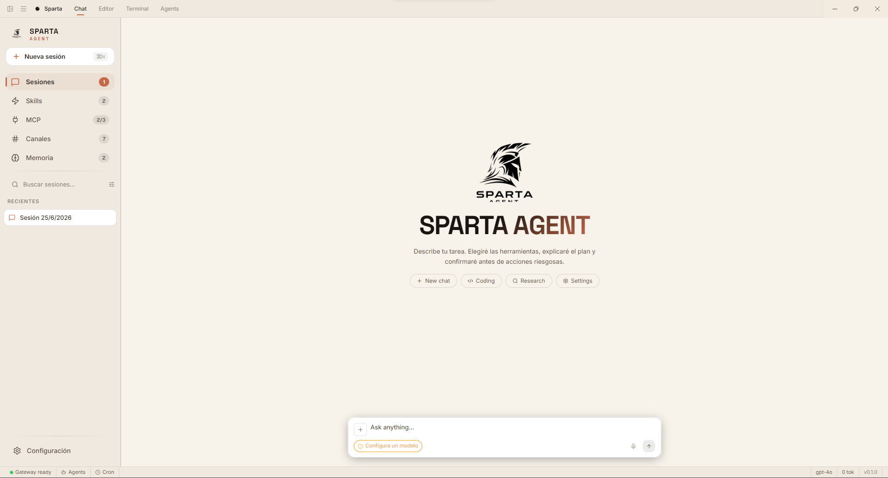

<div align="center">
  
  <h1>Sparta Agent</h1>
  <p><strong>IDE de agentes de IA local-first</strong></p>
  <p>
    React + TypeScript + Vite + Electron + Python + Rust
  </p>
</div>



---

## Tabla de contenidos

1. [Visión general](#visión-general)
2. [Arquitectura](#arquitectura)
3. [Stack tecnológico](#stack-tecnológico)
4. [Seguridad](#seguridad)
5. [Requisitos previos](#requisitos-previos)
6. [Instalación](#instalación)
7. [Configuración sensible](#configuración-sensible)
8. [Comandos disponibles](#comandos-disponibles)
9. [Estructura del proyecto](#estructura-del-proyecto)
10. [Flujos de ejecución](#flujos-de-ejecución)
11. [Uso rápido](#uso-rápido)
12. [Roadmap](#roadmap)
13. [Licencia](#licencia)

---

## Visión general

**Sparta Agent** es un entorno de desarrollo integrado (IDE) para agentes de inteligencia artificial con enfoque *local-first*. Orquesta agentes de lenguaje desde tres superficies de ejecución —escritorio, navegador y terminal— combinando chat unificado, sistema de agentes con subagentes, memoria semántica vectorial, grafo 3D de conocimiento, **servidores MCP reales** (protocolo MCP con SDK oficial, stdio + HTTP), sistema de permisos para acceso fuera del workspace, skills reutilizables y múltiples canales de comunicación.

La aplicación separa claramente la capa de presentación (React + Electron/Web), la capa de inteligencia (sidecar Python con LangGraph) y la capa de seguridad nativa (Rust vía N-API), permitiendo ejecutar el mismo agente en contextos muy distintos sin duplicar lógica de negocio.

### Superficies de ejecución

| Superficie | Tecnología de terminal | Transporte al sidecar | Uso típico |
|------------|------------------------|----------------------|------------|
| **Desktop** | PTY real con `node-pty` (PowerShell / bash) | stdio JSON-RPC + IPC de Electron | Uso diario del IDE con acceso completo al sistema de archivos y vault cifrado. |
| **Web** | Shell pipe vía WebSocket al sidecar FastAPI | WebSocket (chat + terminal) | Desarrollo, demos o entornos donde no se puede ejecutar Electron. |
| **CLI** | REPL propio con Typer + Rich | Directo en el mismo proceso Python | Automatización, scripts o usuarios que prefieren la terminal del sistema. |

### Características principales

- **Chat unificado** con sesiones persistentes, pin, archive y renombrado.
- **Sistema de agentes real** con bucle LLM → tools → subagentes y ejecución paralela.
- **Sidecar Python** (LangGraph + ChromaDB) con streaming vía stdio JSON-RPC (Desktop) o WebSocket (Web).
- **Terminal persistente** en Desktop, Web y CLI; sobrevive a la navegación entre vistas.
- **Módulo de seguridad Rust** (Desktop) para validación de framing JSON-RPC y auditoría.
- **Sanitización y rate limiting** de comandos de shell y herramientas en el sidecar Python (`CommandSanitizer`, `RateLimiter`).
- **Memoria semántica vectorial** con ChromaDB y embeddings (OpenAI / Ollama).
- **Grafo 3D de conocimiento** interactivo con Three.js.
- **Skills reutilizables** con explorador, creador y exportador a `.skill.json`.
- **Servidores MCP reales** (SDK oficial `mcp`, stdio + HTTP, filtros include/exclude, eventos en tiempo real).
- **Sistema de permisos** para operaciones de archivo fuera del workspace con diálogo de aprobación en Desktop (allow-once / allow-session).
- **Canales de comunicación** (Telegram funcional; Discord, Slack, WhatsApp y Email en roadmap).
- **Vault cifrado** para API keys mediante `safeStorage` de Electron (AES-256-GCM).
- **Editor de código** con Monaco Editor (9 lenguajes), file tree y toolbar.
- **13 temas visuales** (8 oscuros + 5 claros).
- **Internacionalización** español / inglés.

---

## Arquitectura

Sparta Agent sigue una arquitectura de tres capas principales que se comunican a través de protocolos bien definidos:

```
┌─────────────────────────────────────────────────────────────────────────────┐
│                              CAPA DE PRESENTACIÓN                            │
│  ┌─────────────┐  ┌─────────────┐  ┌─────────────┐  ┌─────────────────────┐ │
│  │   Chat      │  │  Terminal   │  │   Skills    │  │  Grafo de memoria   │ │
│  │  (React)    │  │  (xterm.js) │  │  Explorer   │  │     (Three.js)      │ │
│  └──────┬──────┘  └──────┬──────┘  └──────┬──────┘  └──────────┬──────────┘ │
│         │                │                │                    │            │
│         └────────────────┴────────────────┴────────────────────┘            │
│                                    │                                        │
│                    Zustand stores  │  IPC / WebSocket / stdio                │
└────────────────────────────────────┼────────────────────────────────────────┘
                                     │
┌────────────────────────────────────┼────────────────────────────────────────┐
│                              CAPA DE ORQUESTACIÓN                            │
│                                    │                                         │
│   ┌────────────────────────────────┴────────────────────────────────┐        │
│   │                     Electron Main Process                        │        │
│   │  • Registro de handlers IPC (chat, terminal, filesystem, vault)  │        │
│   │  • Spawn del sidecar Python con variables de entorno seguras     │        │
│   │  • Módulo Rust: validación de framing JSON-RPC + auditoría       │        │
│   └────────────────────────────────┬────────────────────────────────┘        │
│                                    │                                         │
│   En modo Web se omite Electron; el frontend se conecta directamente al      │
│   servidor FastAPI del sidecar mediante WebSocket.                           │
└────────────────────────────────────┼────────────────────────────────────────┘
                                     │
┌────────────────────────────────────┼────────────────────────────────────────┐
│                              CAPA DE INTELIGENCIA                            │
│                                    │                                         │
│   ┌────────────────────────────────┴────────────────────────────────┐        │
│   │                      Sidecar Python                              │        │
│   │  ┌──────────────┐  ┌──────────────┐  ┌──────────────────────┐   │        │
│   │  │ LangGraph    │  │  ChromaDB    │  │   FastAPI / WebSocket │   │        │
│   │  │ StateGraph   │  │  VectorStore │  │   (modo Web)          │   │        │
│   │  └──────┬───────┘  └──────┬───────┘  └──────────┬───────────┘   │        │
│   │         │                 │                     │               │        │
│   │         └─────────────────┴─────────────────────┘               │        │
│   │                           │                                     │        │
│   │         ┌─────────────────┼─────────────────┐                   │        │
│   │         ▼                 ▼                 ▼                   │        │
│   │  ┌────────────┐  ┌──────────────┐  ┌──────────────┐            │        │
│   │  │ file_tools │  │ terminal_    │  │   web_search │            │        │
│   │  │ (read/write│  │ tools        │  │              │            │        │
│   │  │  search/   │  │              │  │              │            │        │
│   │  │  patch/    │  │              │  │              │            │        │
│   │  │  delete)   │  │              │  │              │            │        │
│   │  └────────────┘  └──────────────┘  └──────────────┘            │        │
│   │                                                                 │        │
│   │  ┌─────────────────────────────────────────────────────────┐   │        │
│   │  │ Seguridad: CommandSanitizer · RateLimiter · Permission  │   │        │
│   │  │ Broker · MCP Client (oficial SDK)                       │   │        │
│   │  └─────────────────────────────────────────────────────────┘   │        │
│   └─────────────────────────────────────────────────────────────────┘        │
└──────────────────────────────────────────────────────────────────────────────┘
```

### Flujo de un mensaje de chat (Desktop)

1. El usuario escribe en el frontend React.
2. El mensaje viaja por `window.sparta.sendMessage` → IPC `chat:send`.
3. El proceso principal de Electron envía el mensaje al sidecar Python por stdin como JSON-RPC.
4. El sidecar ejecuta el grafo LangGraph, llamando a tools cuando es necesario.
5. Los eventos de streaming vuelven por stdout del sidecar, son parseados por el main process y reenviados al renderer por IPC.
6. El renderer actualiza la UI con thinking blocks, tool calls y respuestas.

### Flujo de un comando de terminal (Desktop)

1. `xterm.js` emite cada pulsación por `terminal.onData`.
2. El frontend envía el dato por IPC `terminal:write`.
3. El main process escribe en el PTY creado con `node-pty`.
4. La salida del PTY se reenvía al renderer y se dibuja en `xterm.js`.

### Flujo de un comando de terminal (Web)

1. `xterm.js` emite cada pulsación.
2. El frontend abre un WebSocket a `/ws/terminal/{session_id}`.
3. Se realiza un handshake de autenticación con el token `SPARTA_WS_TOKEN`.
4. Una vez autenticado, el sidecar spawnea un shell pipe.
5. Las líneas completas se sanitizan antes de escribirse en `stdin` del shell.
6. La salida vuelve por el mismo WebSocket.

---

## Stack tecnológico

| Capa | Tecnología | Propósito |
|------|------------|-----------|
| UI Framework | React 18 + TypeScript | Componentes de interfaz tipados. |
| Bundler | Vite 5 | Compilación rápida y HMR. |
| Desktop Shell | Electron 30 | Ventana nativa, IPC, safeStorage, node-pty. |
| State Management | Zustand 5 + persist | Estado global con persistencia selectiva. |
| UI Library | shadcn/ui + `@base-ui/react` | Componentes accesibles y estilizables. |
| Estilos | Tailwind CSS v4 | Utilidades de diseño. |
| Animaciones | Framer Motion | Transiciones y microinteracciones. |
| Grafo 3D | three.js 0.184 (lazy-loaded) | Visualización de memoria y relaciones. |
| Editor de código | Monaco Editor | Edición de archivos con syntax highlighting. |
| Terminal | xterm.js + node-pty / WebSocket | Terminal interactiva en Desktop y Web. |
| AI Sidecar | Python 3.11+ / LangGraph / LangChain / ChromaDB | Orquestación de agentes y memoria. |
| Web Server | FastAPI / Uvicorn | Endpoint WebSocket para modo Web. |
| Security Layer | Rust / napi-rs (Desktop) | Validación de framing JSON-RPC y auditoría. |
| Sanitización | Python `CommandSanitizer` + `RateLimiter` | Gateo de ejecución de shell y tools. |
| Vector DB | ChromaDB (HTTP directo) | Memoria semántica y búsqueda por similitud. |
| Vault | Electron `safeStorage` (AES-256-GCM) | Almacenamiento cifrado de API keys. |
| Iconos | Lucide React + SVGs propios | Iconografía consistente. |
| Fuentes | Inter, Space Grotesk, Geist Variable | Tipografía de interfaz. |
| Tests JS | vitest (59 tests) | Tests unitarios del frontend. |
| Tests Python | pytest (63 tests) | Tests del sidecar (tools, streaming, agent, providers). |
| Tests Rust | cargo test (9 tests) | Tests del módulo nativo. |
| Package Manager | pnpm | Gestión de dependencias. |
| Builder | electron-builder | Empaquetado de la aplicación. |

---

## Seguridad

La seguridad se aplica en múltiples capas:

### 1. Transporte seguro entre Electron y Python (Desktop)

- El sidecar Python se spawnea desde el proceso principal de Electron con un token único (`SPARTA_WS_TOKEN`) y variables de entorno controladas.
- El módulo Rust valida el framing de los mensajes JSON-RPC y mantiene un log de auditoría.
- Las API keys no viajan en texto plano: se almacenan en el vault cifrado de Electron y se inyectan en caché al sidecar una vez que este reporta estar listo.

### 2. Sanitización de comandos de shell

- Todos los comandos que el agente intenta ejecutar pasan por `CommandSanitizer`.
- Se bloquean patrones peligrosos: `rm -rf /`, redirecciones a dispositivos raw, escalada de privilegios, pivoting de red, exfiltración de credenciales, etc.
- En Desktop/Web, comandos que no estén en la lista de comandos seguros requieren confirmación humana antes de ejecutarse.
- En CLI, al correr con los privilegios del propio usuario, se salta la confirmación pero se mantiene el filtro de bloqueo.

### 3. Rate limiting

- `RateLimiter` (token bucket) protege tanto las llamadas a tools como los mensajes de entrada del terminal Web.
- Límites actuales: 15 tokens con recarga de 3/s para terminal; 30 tokens con recarga de 5/s para tools.

### 4. Terminal Web endurecido

El endpoint `/ws/terminal/{session_id}` implementa:

- **Origin check estricto**: rechaza conexiones sin header `Origin` o con orígenes no permitidos.
- **Autenticación por token**: requiere `SPARTA_WS_TOKEN` vía header `x-sparta-token` o primer frame `{"type": "auth", "token": "..."}`.
- **Bind restringido**: por defecto escucha en `127.0.0.1`, nunca en `0.0.0.0`.
- **Sanitización por línea**: solo se envían líneas completas al shell, previa validación.
- **Rate limiting por sesión**.

> **Advertencia**: el modo Web sigue usando un shell *pipe* (no PTY). Esto significa que programas interactivos como `vim`, `htop` o `sudo` con prompt no funcionan correctamente. Para uso completo se recomienda la versión Desktop con `node-pty`. Además, el endpoint `/ws/terminal` necesita un fix de seguridad pendiente antes de considerarse listo para producción.

---

## Requisitos previos

- [Node.js](https://nodejs.org/) (versión LTS recomendada)
- [pnpm](https://pnpm.io/)
- [Python](https://www.python.org/) 3.11+ (para el sidecar de IA)
- [Rust](https://www.rust-lang.org/) (solo para compilar el módulo de seguridad nativo; opcional para desarrollo web)

Instalar pnpm si no lo tienes:

```bash
npm install -g pnpm
```

---

## Instalación

1. Clonar o ubicarse en el directorio del proyecto:

```bash
cd sparta-agent
```

2. Instalar dependencias de Node:

```bash
pnpm install
```

3. Configurar el sidecar Python:

```bash
pnpm sidecar:setup
```

4. (Opcional, Desktop) Compilar el módulo de seguridad Rust:

```bash
pnpm rust:napi
```

5. Iniciar el entorno de desarrollo Desktop:

```bash
pnpm dev
```

Esto levanta Vite, lanza Electron e inicia el sidecar Python automáticamente.

### Modo Web

Para ejecutar solo el frontend web contra un sidecar FastAPI:

```bash
# Terminal 1: levantar el sidecar web con token
SPARTA_WS_TOKEN=$(uuidgen) pnpm sidecar:web

# Terminal 2: levantar el frontend en modo web
pnpm dev:web
```

En Windows (PowerShell):

```powershell
$env:SPARTA_WS_TOKEN = [guid]::NewGuid().ToString()
pnpm sidecar:web
```

### Usar el CLI

```bash
python -m sparta_ai.cli repl
```

Abre un REPL en la terminal del sistema contra el mismo agente LangGraph que usan Desktop y Web, con historial persistente en `~/.sparta_cli_history`.

---

## Configuración sensible

Las siguientes variables de entorno controlan comportamientos críticos de seguridad y rutas de datos:

| Variable | Descripción | Requerida |
|----------|-------------|-----------|
| `SPARTA_WS_TOKEN` | Token compartido entre el sidecar web y el frontend para autenticar el WebSocket de terminal. | Sí, en modo Web. |
| `SPARTA_WORKSPACE_ROOT` | Raíz del workspace sobre el que operan las tools de archivo. | No; por defecto usa el directorio de trabajo. |
| `SPARTA_DATA_DIR` | Directorio donde se almacenan bases de datos y caché del sidecar. | No; usa `.sparta` en dev o `userData/data` en producción. |
| `ANTHROPIC_API_KEY` | API key de Anthropic para modelos Claude. | No; también se puede ingresar en UI. |
| `OPENAI_API_KEY` | API key de OpenAI para embeddings y modelos GPT. | No; también se puede ingresar en UI. |
| `GOOGLE_API_KEY` | API key de Google para modelos Gemini. | No; también se puede ingresar en UI. |
| `OLLAMA_HOST` | Host de Ollama para modelos locales. | No; por defecto `http://localhost:11434`. |

### Variables de entorno del frontend (Vite)

| Variable | Descripción |
|----------|-------------|
| `VITE_SIDECAR_HOST` | Host del sidecar web. Por defecto `localhost`. |
| `VITE_SIDECAR_WS_PORT` | Puerto del WebSocket del sidecar. Por defecto `8765`. |
| `VITE_SPARTA_WS_TOKEN` | Token de autenticación del terminal web. Debe coincidir con `SPARTA_WS_TOKEN` del sidecar. |

---

## Comandos disponibles

| Comando | Descripción |
|---------|-------------|
| `pnpm dev` | Inicia Vite + Electron + sidecar Python en modo desarrollo. |
| `pnpm dev:web` | Inicia solo el frontend en modo web. |
| `pnpm build` | Compila TypeScript, build Vite y empaqueta con electron-builder. |
| `pnpm build:web` | Genera solo el build estático para web. |
| `pnpm test` | Ejecuta tests JS (vitest, 59 tests). |
| `pnpm lint` | Ejecuta ESLint sobre `.ts` y `.tsx`. |
| `pnpm preview` | Previsualiza el build de Vite. |
| `pnpm sidecar:setup` | Crea venv Python e instala dependencias del sidecar. |
| `pnpm sidecar:test` | Ejecuta tests Python (pytest, 63 tests). |
| `pnpm sidecar:run` | Ejecuta el sidecar manualmente (stdin/stdout). |
| `pnpm sidecar:web` | Ejecuta el servidor FastAPI del sidecar para modo web. |
| `pnpm rust:test` | Ejecuta tests Rust (cargo test, 9 tests). |
| `pnpm rust:build` | Compila el módulo Rust en modo release. |
| `pnpm rust:napi` | Compila el native addon N-API de Rust. |
| `pnpm rebuild-native` | Recompila `node-pty` para la arquitectura actual. |

---

## Estructura del proyecto

```
sparta-agent/
├── electron/                  # Proceso principal de Electron + handlers IPC
│   ├── ipc/                   # Chat, terminal, filesystem, vault, skills, sidecar
│   ├── preload.ts             # Exposición segura de APIs al renderer
│   └── main.ts                # Punto de entrada de Electron
├── public/                    # Assets estáticos, iconos, skills, screenshots
├── src/                       # Código fuente React + TypeScript
│   ├── components/            # Componentes React
│   │   ├── chat/              # Chat, reasoning, tool calls
│   │   ├── terminal/          # TerminalSlot, PersistentTerminal, TerminalWorkspace
│   │   ├── settings/          # Paneles de configuración
│   │   └── ui/                # Componentes base (shadcn/ui)
│   ├── hooks/                 # Hooks personalizados
│   ├── i18n/                  # Internacionalización ES/EN
│   ├── lib/                   # Utilidades, drivers, temas
│   │   ├── terminal-ws-driver.ts  # Driver WebSocket del terminal web
│   │   ├── env-adapter.ts     # Detección de entorno (Electron / Web)
│   │   └── xterm-theme.ts     # Temas para xterm.js
│   ├── services/              # Capa de servicios (AI, memory, agents, chat, MCP)
│   ├── stores/                # Stores Zustand (con persist)
│   ├── styles/                # CSS global + 13 temas visuales
│   ├── types/                 # Definiciones globales de TypeScript
│   └── main.tsx               # Punto de entrada del renderer
├── python/
│   └── sparta_ai/             # Sidecar Python
│       ├── agents/            # StateGraph, subagentes, research, code, memory
│       ├── tools/             # web_search, file_tools, memory_tools, terminal_tools, mcp_client
│       ├── security/          # CommandSanitizer, RateLimiter
│       ├── memory/            # ChromaDB VectorStore + grafo de conocimiento
│       ├── streaming/         # Event bridge LangGraph → JSON-RPC / WebSocket
│       ├── cli.py             # REPL de terminal (Typer + Rich)
│       ├── server_web.py      # Servidor FastAPI para modo Web (chat + terminal)
│       └── tests/             # Tests Python (pytest)
├── rust/
│   └── sparta-security/       # Módulo nativo Rust (Desktop)
│       └── src/               # validator, guard, audit
├── docs/                      # Documentación técnica adicional
├── package.json
├── vite.config.ts
├── tsconfig.json
└── README.md
```

---

## Flujos de ejecución

### Agente ejecutando un comando en el terminal

```
Usuario (UI)
    │
    ▼
LLM decide llamar a terminal_execute_tool(command)
    │
    ▼
Sidecar Python sanitiza el comando (CommandSanitizer)
    │
    ├── Si es peligroso ──► Bloqueado, retorna error al LLM.
    │
    └── Si requiere confirmación (Desktop/Web) ──► Se muestra UI de confirmación al usuario.
        │
        └── Si el usuario confirma o el comando es seguro ──► Se escribe en el PTY/WebSocket.
```

### Persistencia del terminal entre vistas

```
TerminalWorkspace monta <PersistentTerminal /> como hermano de <TitleBar />
    │
    ├── PersistentTerminal renderiza las pestañas de terminal siempre, independientemente de isFullView.
    │
    └── TerminalWorkspace crea/destuye instancias de xterm.js, pero el proceso PTY/WebSocket
        permanece vivo mientras la pestaña exista en el store.
```

---

## Uso rápido

1. Abre la aplicación con `pnpm dev` (el sidecar Python se inicia automáticamente).
2. Configura un proveedor de modelo desde **Configuración → Models** e ingresa tu API key (se cifra en el vault).
3. Crea una nueva sesión desde el sidebar y empieza a chatear.
4. Usa el panel de **Agentes** para ejecutar tareas complejas con subagentes.
5. Activa la **memoria semántica** desde Configuración → Memory para búsqueda contextual.
6. Explora las vistas de **Skills**, **MCP**, **Canales**, **Memoria** y **Editor** desde la barra lateral.
7. Abre el **Terminal** desde la barra inferior; la misma sesión sigue viva aunque navegues a otras vistas.

---

## Roadmap

### Completado

- [x] Chat conectado con APIs reales (Anthropic, OpenAI, Ollama).
- [x] Monaco Editor integrado con 9 lenguajes.
- [x] Terminal Desktop con PTY real (`node-pty` + PowerShell / bash), persistente entre vistas.
- [x] Terminal Web (WebSocket al sidecar) y Terminal CLI (REPL Typer + Rich).
- [x] Sistema de agentes real con subagentes y ejecución paralela.
- [x] Sidecar Python con LangGraph, ChromaDB, streaming JSON-RPC / WebSocket.
- [x] Módulo Rust de validación de framing JSON-RPC + auditoría.
- [x] Vault cifrado para API keys con `safeStorage` de Electron.
- [x] Memoria semántica vectorial con ChromaDB + embeddings.
- [x] Lazy loading de Three.js y vistas pesadas.
- [x] Thinking block, tool calls, interrupt-and-redirect.
- [x] Endurecimiento de `/ws/terminal` (token de auth, sanitizar input por línea, bind a `127.0.0.1` por defecto).
- [x] Rate limiter Rust persistente entre llamadas napi (instancia global vía `Lazy<Mutex<>>`).
- [x] Cliente MCP real (SDK oficial `mcp`, stdio + HTTP, include/exclude filters, eventos en tiempo real vía emit_fn).
- [x] Sistema de permisos para archivos fuera del workspace (diálogo allow-once / allow-session en Desktop).
- [x] Nuevas tools de archivo: `search_files_tool` (grep+glob), `patch_file_tool` (old→new + diff), `delete_file_tool`.

### En progreso / Pendiente
- [ ] Terminal Web con PTY real (hoy usa pipes: sin job control, programas interactivos como `vim` / `htop` no redibujan bien).
- [ ] Scrollback persistente del terminal (serialización con `@xterm/addon-serialize`).
- [ ] Búsqueda dentro del scrollback (`@xterm/addon-search`).
- [ ] Atajo de teclado para nueva terminal.
- [ ] Adjuntos reales (archivos, snippets, imágenes, URLs).
- [ ] Grabación de audio por micrófono.
- [ ] Integraciones reales de Discord, Slack, WhatsApp y Email.
- [ ] Auto-learning de la memoria.
- [ ] Endurecimiento Fase 5: stale file check, fuzzy matching en patch, denylist ampliada, límites de tamaño.
- [ ] Tests y CI/CD completo.

---

## Licencia

MIT — Uso libre bajo los términos de la licencia.

---

<div align="center">
  <sub>Hecho con disciplina espartana.</sub>
</div>
