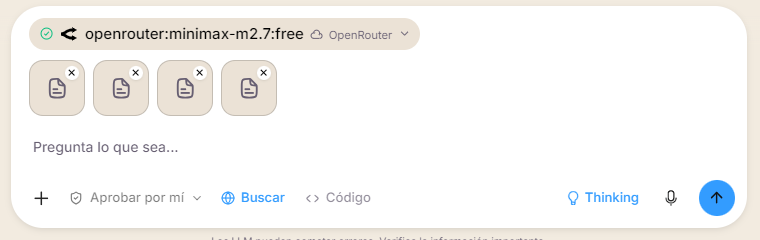

<div align="center">
  
  <h1>Sparta Agent</h1>
  <p><strong>Plataforma de Desarrollo Agéntica Local-First para Equipos de Ingeniería</strong></p>

  <p>
    <a href="https://github.com/Naiker12/Sparta-Agent/releases/tag/v0.2.0"></a>
    
    
    
    
    
    
  </p>
</div>

---

<div align="center">
  
  <br />
  <sub>Entorno de Desarrollo y Orquestación Agéntica en Tiempo Real</sub>
</div>

<br />

<div align="center">
  <table width="100%">
    <tr>
      <td width="50%" align="center">
        
        <br />
        <sub>Diálogo Modal de Permisos y Validación Previa</sub>
      </td>
      <td width="50%" align="center">
        
        <br />
        <sub>Gestión Dinámica de Contexto y Proveedores</sub>
      </td>
    </tr>
  </table>
</div>

---

## Tabla de Contenidos

- [Propuesta de Valor](#propuesta-de-valor)
- [Características Principales](#características-principales)
- [Arquitectura del Sistema](#arquitectura-del-sistema)
- [Matriz de Seguridad y Privacidad](#matriz-de-seguridad-y-privacidad)
- [Ecosistema MCP (Model Context Protocol)](#ecosistema-mcp-model-context-protocol)
- [Proveedores de IA Compatibles](#proveedores-de-ia-compatibles)
- [Instalación y Puesta en Marcha](#instalación-y-puesta-en-marcha)
- [Estructura del Proyecto](#estructura-del-proyecto)
- [Licencia](#licencia)

---

## Propuesta de Valor

En el desarrollo de software actual, la productividad de los equipos de ingeniería requiere herramientas autónomas con comprensión integral del código.

**Sparta Agent** es un **IDE agéntico autónomo y local-first**, diseñado para desarrolladores y organizaciones técnicas:

1. **Privacidad y Cumplimiento**: Ejecución y análisis dentro del perímetro local de tu equipo. Protección estricta de código propietario y datos sensibles.
2. **Optimización de Costos**: Alterna dinámicamente entre modelos locales (Ollama, LM Studio, llama.cpp) y APIs cloud avanzadas (Gemini 2.5, Claude 3.7, OpenAI, DeepSeek).
3. **Supervisión y Control Humano**: Planificación transparente, ejecución de comandos auditada mediante diálogos modales de permisos y diffs precisos.

---

## Características Principales

* **Chat Temporal e Incógnito**: Sesiones efímeras de trabajo que no persisten en el historial local para consultas rápidas o pruebas aisladas.
* **Control Granular de Permisos**: Validación previa obligatoria para cada acción que cree, modifique o elimine archivos, o invoque comandos de terminal.
* **Motor de Diferenciales Preciso**: Revisión interactiva de cambios en el código fuente con soporte de resaltado sintáctico.
* **Terminal Multi-Shell Integrado**: Ejecución protegida de comandos en PowerShell, Bash o Zsh con filtros de seguridad activos.
* **Previsualización Nativa de Documentos**: Visores integrados para hojas de cálculo Excel (`.xlsx`, `.xls`), documentos Word (`.docx`), archivos PDF, Markdown e imágenes.
* **Conexión MCP Estándar**: Integración directa con bases de datos, repositorios Git, herramientas de navegador y servicios cloud mediante Model Context Protocol.

---

## Arquitectura del Sistema

```text
┌─────────────────────────────────────────────────────────────────────────┐
│ 1. CAPA DE PRESENTACIÓN (React 19 / Vite / TailwindCSS / Radix UI)       │
│ Interfaz moderna con soporte de temas, chat temporal, diffs interactivos│
│ y paneles de control contextuales.                                      │
└────────────────────────────┬────────────────────────────────────────────┘
                             │ Canal IPC Seguro (Electron Preload / ContextBridge)
┌────────────────────────────┴────────────────────────────────────────────┐
│ 2. MOTOR AGÉNTICO Y ORQUESTACIÓN (Electron Main / Node.js Engine)       │
│ Orquestador de herramientas MCP, broker de permisos nativo, terminal    │
│ PTY interactivo y gestor de almacenamiento seguro.                      │
└────────────────────────────┬────────────────────────────────────────────┘
                             │ Conectores Locales / REST / Stdio
┌────────────────────────────┴────────────────────────────────────────────┐
│ 3. HERRAMIENTAS Y SERVICIOS CONECTADOS (MCP Core)                       │
│ Filesystem, GitHub, Git, Bases de Datos (Postgres/MySQL/SQLite),        │
│ Servicios Google, Slack, Notion y Modelos Locales/Cloud.                │
└─────────────────────────────────────────────────────────────────────────┘
```

---

## Matriz de Seguridad y Privacidad

| Componente | Función | Descripción |
| :--- | :--- | :--- |
| **Permission Dialog** | Aprobación Obligatoria | Cada acción que altere el sistema de archivos o ejecute comandos requiere confirmación explícita previa del usuario. |
| **Command Sanitizer** | Inspección de Comandos | Prevención en tiempo real contra la ejecución de scripts destructivos o llamadas no autorizadas al sistema operativo. |
| **Path Guard** | Aislamiento de Espacios | Restricción de operaciones de lectura y escritura al directorio de trabajo autorizado del proyecto actual. |
| **Vault Cifrado** | Credenciales Locales | Almacenamiento local protegido de claves de API mediante `electron.safeStorage`. |

---

## Ecosistema MCP (Model Context Protocol)

Sparta Agent incorpora conectividad nativa con el estándar Model Context Protocol:

* **Control de Versiones**: GitHub, Git Local
* **Archivos y Almacenamiento**: Filesystem Local, Google Drive, OneDrive
* **Bases de Datos**: PostgreSQL, MySQL, SQLite, Supabase, MongoDB
* **Productividad**: Notion, Gmail, Google Calendar
* **Colaboración**: Slack, Figma
* **Navegación Web**: Playwright, Chrome DevTools, Fetch RAG

---

## Proveedores de IA Compatibles

* **Locales (100% Offline)**: Ollama, LM Studio, llama.cpp, Servidores OpenAI-compatible.
* **Cloud (Alto Rendimiento)**: Google Gemini (2.5 Flash, 2.0 Flash, 1.5 Pro), Anthropic Claude, OpenAI (GPT-4o, o3-mini), DeepSeek, Groq, Mistral, OpenRouter, Together AI, Fireworks AI.

---

## Instalación y Puesta en Marcha

### Requisitos Previos
* **Node.js**: `v20.0.0` o superior (Recomendado `v22+ LTS`)
* **npm**: `v10+`

### Pasos de Instalación

```bash
# 1. Clonar el repositorio
git clone https://github.com/Naiker12/Sparta-Agent.git
cd Sparta-Agent

# 2. Instalar dependencias del proyecto
npm install

# 3. Instalar dependencias del frontend de escritorio
npm --prefix desktop/frontend-spartan install

# 4. Iniciar en modo desarrollo
npm run dev
```

### Comandos de Utilidad

```bash
# Validación de tipos estáticos
npm run typecheck

# Análisis de código con linter
npm run lint

# Ejecución de pruebas unitarias
npm test

# Compilación de la landing page
npm run landing:build

# Compilación de binarios de escritorio
npm run build
```

---

## Estructura del Proyecto

```text
Sparta-Agent/
├── desktop/
│   ├── frontend-spartan/     # Interfaz de usuario (React + Vite + Assistant-UI)
│   ├── backend-spartan/      # Servicios y motor de soporte backend
│   ├── ia-sparta-app-shell/  # Proceso principal Electron y gestor de ventanas
│   └── ia-sparta-ipc-bridge/ # Canales IPC de comunicación segura
├── docs/                     # Documentación técnica y capturas de pantalla
├── landing/                  # Landing page del producto (Vite + React + TailwindCSS)
├── public/                   # Recursos estáticos, logotipos e iconos
├── skills/                   # Habilidades y plugins agénticos modulares
├── tests/                    # Pruebas unitarias del sistema
├── electron-builder.config.cjs # Configuración de empaquetado (Win / Mac / Linux)
└── package.json              # Configuración y scripts del proyecto
```

---

## Licencia

Este proyecto está distribuido bajo la Licencia **MIT**. Consulta el archivo [LICENSE](LICENSE) para más detalles.

<div align="center">
  <sub>Desarrollado para la comunidad de ingeniería de software.</sub>
</div>
