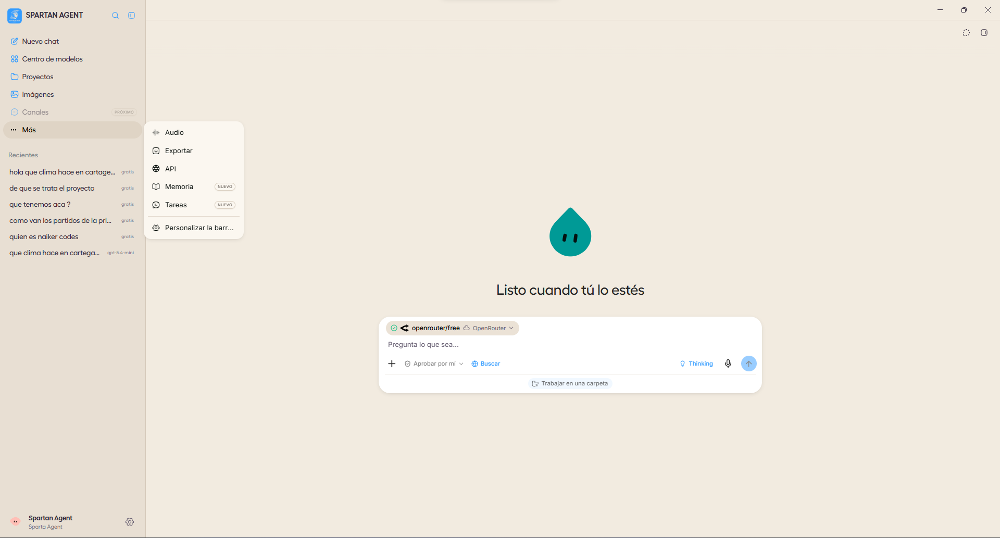

<div align="center">
  
  <h1>Sparta Agent</h1>
  <p><strong>Un espacio de trabajo para construir software con agentes, modelos locales y control humano.</strong></p>

  <p>
    <a href="https://github.com/Naiker12/Sparta-Agent/releases"></a>
    
    
    
  </p>
</div>

---

<div align="center">
  
</div>

---

> **Local cuando lo necesitas; conectado cuando lo eliges.** Sparta Agent combina chat, herramientas y contexto de proyecto en una aplicación de escritorio. Las acciones que afectan archivos o comandos pasan por un control explícito.

## En un vistazo

| Para | Sparta Agent aporta |
| --- | --- |
| Trabajar con tu código | Chat orientado a tareas, contexto de proyecto, diffs y una terminal integrada. |
| Usar modelos locales | Compatibilidad con Ollama, LM Studio, llama.cpp y servidores compatibles con OpenAI. |
| Conectar servicios | Integraciones mediante Model Context Protocol (MCP), con conectores locales, HTTP y stdio. |
| Mantener el control | Aprobaciones antes de acciones sensibles y almacenamiento local protegido de credenciales. |

## Empieza aquí

Descarga el instalador desde las [releases](https://github.com/Naiker12/Sparta-Agent/releases). En el primer arranque, Sparta Agent prepara su motor local en su propio directorio de datos y muestra el progreso; no reutiliza la instalación de otra aplicación.

Para desarrollo:

```bash
git clone https://github.com/Naiker12/Sparta-Agent.git
cd Sparta-Agent
npm ci
npm --prefix desktop/frontend-spartan ci
npm run dev
```

Requisitos: Node.js 20 o posterior y npm 10 o posterior. El motor Python local se prepara desde la aplicación cuando es necesario.

---

## Capacidades

- **Sesiones de trabajo:** chat normal o temporal, selección de modelo y gestión de contexto.
- **Herramientas con permiso:** revisión de cambios, acciones sobre archivos y terminal con confirmación previa.
- **Documentos en contexto:** previsualización de Markdown, PDF, imágenes y formatos de oficina compatibles.
- **MCP:** Git, sistemas de archivos, bases de datos, navegador y otros servicios configurables.
- **Modo sin conexión:** los proveedores remotos no se presentan como disponibles cuando no hay conectividad.

---

## Arquitectura

| Capa | Responsabilidad | Tecnología principal |
| --- | --- | --- |
| Aplicación | Interfaz, conversaciones y estados de la sesión | React, Vite, Tailwind |
| Escritorio | Ventana, ciclo de vida, permisos e IPC aislado | Electron + ContextBridge |
| Motor local | API, preparación de dependencias y ejecución local | Python |
| Integraciones | Modelos, conectores y herramientas externas | MCP, REST y stdio |

La interfaz no recibe acceso directo al sistema operativo: las operaciones de escritorio pasan por un puente IPC acotado y el proceso principal es quien las autoriza.

---

## Seguridad y privacidad

| Control | Aplicación |
| --- | --- |
| Confirmación de acciones | Las operaciones que pueden modificar archivos o lanzar comandos requieren aprobación. |
| Alcance de archivos | Las rutas se validan contra el espacio de trabajo autorizado. |
| Secretos | Las credenciales se guardan localmente mediante el almacenamiento seguro de Electron cuando está disponible. |
| Ejecución local | El runtime del backend vive en los datos de Sparta Agent, separado de instalaciones de terceros. |

---

## MCP e IA

Sparta Agent usa el estándar Model Context Protocol para conectar Git, sistemas de archivos, bases de datos, herramientas de navegador y servicios configurables. Los conectores pueden operar por procesos locales, HTTP o stdio.

En cuanto a modelos, puedes trabajar completamente en local con Ollama, LM Studio, llama.cpp o servidores compatibles con OpenAI. Las opciones cloud se habilitan solo cuando existe conexión y se han configurado sus credenciales.

---

## Comandos de mantenimiento

```bash
npm run typecheck      # Comprueba TypeScript
npm run lint           # Ejecuta el linter
npm test               # Ejecuta las pruebas
npm run landing:build  # Construye la landing
npm run build          # Empaqueta la aplicación de escritorio
```

---

## Estructura del Proyecto

```text
desktop/
  frontend-spartan/     # Aplicación React
  backend-spartan/      # Motor Python local
  ia-sparta-app-shell/  # Proceso principal de Electron
  ia-sparta-ipc-bridge/ # API IPC expuesta al renderer
docs/                   # Guías, capturas y notas de versión
landing/                # Sitio público
tests/                  # Pruebas del proyecto
```

---

## Contribuir y soporte

Los problemas, ideas y propuestas son bienvenidos en los [issues](https://github.com/Naiker12/Sparta-Agent/issues). Antes de abrir un cambio, ejecuta los comandos de validación anteriores y conserva los límites entre renderer, IPC y proceso principal.

## Licencia

Sparta Agent se distribuye bajo la licencia [MIT](LICENSE).
