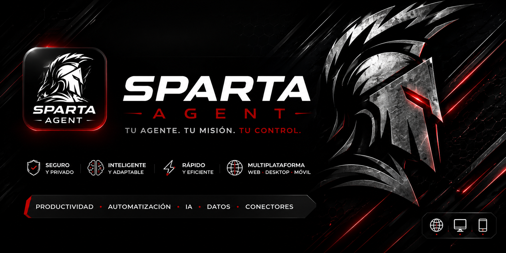
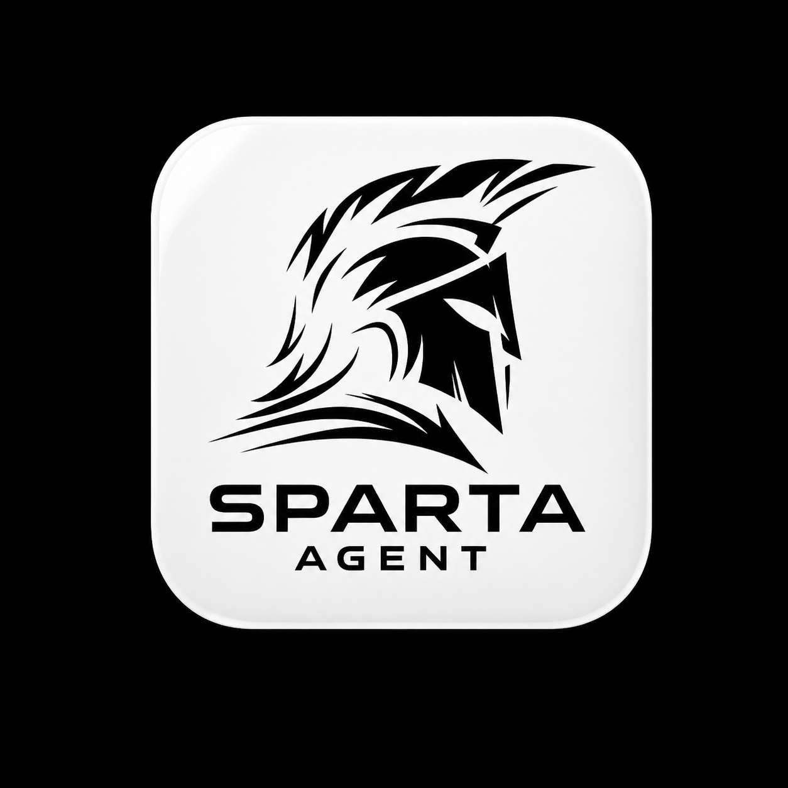
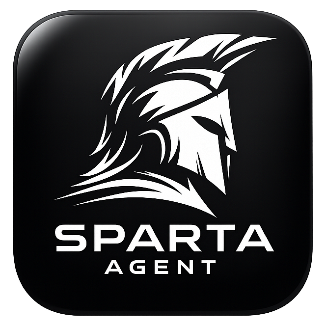
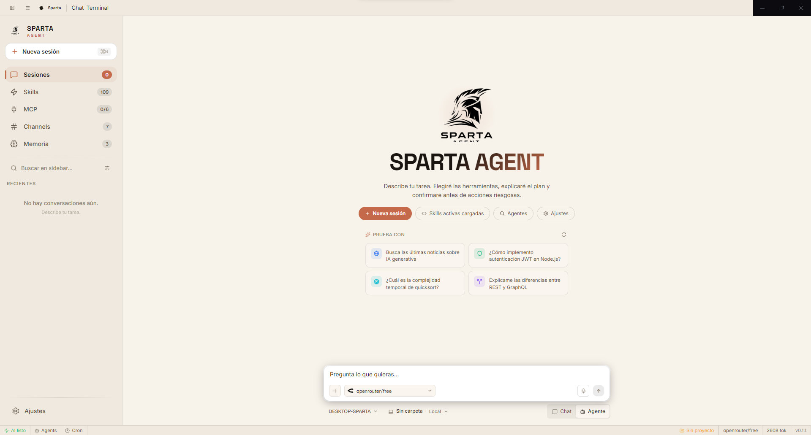

<div align="center">
  

  <h1> Sparta Agent</h1>

  <p><strong>Plataforma de Desarrollo Agéntica Local-First para Equipos de Ingeniería de Alto Rendimiento</strong></p>

  <p>
    <a href="https://github.com/Naiker12/Sparta-Agent"></a>
    
    
    
    
    
    
    
  </p>
</div>

---

##  Tabla de Contenidos
- [ Galería del Sistema](#-galería-del-sistema)
- [ Propuesta de Valor y Caso de Negocio](#-propuesta-de-valor-y-caso-de-negocio)
- [ Características Principales](#-características-principales)
- [ Arquitectura Conceptual del Sistema](#️-arquitectura-conceptual-del-sistema)
- [ Matriz de Seguridad y Privacidad](#️-matriz-de-seguridad-y-privacidad)
- [ Catálogo de Integraciones MCP Nativas](#-catálogo-de-integraciones-mcp-nativas)
- [ Proveedores de IA Compatibles](#-proveedores-de-ia-compatibles)
- [ Requisitos e Instalación](#️-requisitos-e-instalación)
- [ Uso de la CLI Sparta](#-uso-de-la-cli-sparta)
- [ Estructura del Proyecto](#-estructura-del-proyecto)
- [ Hoja de Ruta (Roadmap)](#-hoja-de-ruta-roadmap)
- [ Licencia](#-licencia)

---

##  Galería del Sistema

<div align="center">
  <table width="100%">
    <tr>
      <td width="50%" align="center">
        
        <br />
        <sub><b>Figura 1: Entorno de Desarrollo y Panel de Artefactos Nativo</b></sub>
      </td>
      <td width="50%" align="center">
        
        <br />
        <sub><b>Figura 2: Orquestación Agéntica y Consola Integrada</b></sub>
      </td>
    </tr>
  </table>
  <br />
  
  <br />
  <sub><b>Figura 3: Panel Principal e Integración Multimodal</b></sub>
</div>

---

##  Propuesta de Valor y Caso de Negocio

En la era de la Inteligencia Artificial aplicada al desarrollo de software, la productividad real de los equipos de ingeniería se ve obstaculizada por herramientas de autocompletado pasivo que sugieren fragmentos aislados sin comprensión holística del código.

**Sparta Agent** redefine este paradigma al ofrecer un **IDE agéntico autónomo y local-first**. Diseñado para empresas y desarrolladores exigentes, resuelve los tres principales desafíos técnicos y corporativos:

### 1.  Protección de Propiedad Intelectual y Cumplimiento (Compliance)
Las soluciones cloud convencionales transmiten código fuente sensible a servidores de terceros. Sparta Agent opera bajo un enfoque **Local-First**, ejecutando el análisis de archivos, la indexación del espacio de trabajo y el control de flujos dentro del perímetro de seguridad local. Cumple estrictamente con normativas **GDPR, CCPA, HIPAA** y estándares bancarios de confidencialidad.

### 2.  Optimización de Costos (TCO) y Flexibilidad de Modelos
El consumo masivo de APIs comerciales genera costos de tokens impredecibles. Sparta Agent incluye una capa de abstracción multi-proveedor que permite alternar dinámicamente entre modelos locales de código abierto (Ollama, LM Studio, llama.cpp) para tareas de rutina, y modelos cloud avanzados (Gemini 2.5 Flash, Anthropic, OpenAI, DeepSeek) para tareas arquitectónicas complejas, reduciendo el Costo Total de Propiedad (TCO) hasta en un **70%**.

### 3.  Autonomía Real vs Copilotos Pasivos
A diferencia de las extensiones tradicionales, Sparta Agent funciona como un miembro sintético autónomo del equipo. Ejecuta ciclos estructurados de **Planificación (`create_plan`), Ejecución, Diagnóstico y Reflexión**. Analiza proyectos completos, ejecuta comandos en entornos seguros, valida cambios mediante linters/compiladores locales y entrega soluciones probadas y listas para producción.

---

## Características Principales

*    Planificación Transparente e Interactiva (`create_plan`)**: Cada tarea se desglosa en un plan de ejecución visual en tiempo real. El desarrollador puede inspeccionar, pausar o guiar el plan en cualquier momento.
*    Previsualizaciones Nativas de Documentos**: Visores nativos para archivos de **Excel (`.xlsx`, `.xls`)**, **Word (`.docx`)**, PDF, imágenes y código fuente directamente dentro del panel de artefactos.
*    Adjuntos Flotantes e Imágenes Multimodales**: Soporte para Drag & Drop y pegado de imágenes (`Ctrl+V`) con tarjetas visuales (*chips*) tipo ChatGPT/Claude y soporte de visión por IA.
*    Editor de Código Monaco & Diferenciales Inteligentes**: Integración directa con Monaco Editor y un motor de diffs ultra dinámico impulsado por `@pierre/diffs` y `@pierre/trees` para revisión precisa de cambios.
*    Terminal Emulado Nativo (`xterm.js` + `node-pty`)**: Shell multi-instancia totalmente interactivo integrado en el entorno de desarrollo para compilar, ejecutar pruebas y gestores de paquetes.
*    Protocolo MCP (Model Context Protocol)**: Conectividad nativa estándar con decenas de servidores MCP (GitHub, bases de datos, productividad, navegadores y herramientas de monitoreo).
*    Árboles de Razonamiento Visual ("Thinking Orbs")**: Visualización interactiva de estados de pensamiento y subagentes en ejecución en tiempo real.
*    Broker de Seguridad y Permisos (Rust Core)**: Intercepción nativa de comandos peligrosos (`CommandSanitizer`), protección de rutas sensibles (`PathGuard`) y diálogos modales de autorización previa.

---

##  Arquitectura Conceptual del Sistema

Sparta Agent está estructurado bajo una **arquitectura desacoplada de tres capas**, garantizando alto rendimiento, baja latencia y modularidad:

```text
┌─────────────────────────────────────────────────────────────────────────┐
│ 1. CAPA DE PRESENTACIÓN (React 18 / Monaco Editor / xterm.js)            │
│ Interfaz de usuario rica con visualización de planes, diffs interactivos,│
│ consolas múltiples, gestión de MCPs y renderizado de componentes UI.    │
└────────────────────────────┬────────────────────────────────────────────┘
                             │ Comunicación IPC Segura (Electron ContextBridge)
┌────────────────────────────┴────────────────────────────────────────────┐
│ 2. CAPA DE ORQUESTACIÓN (Electron Main / Node.js Engine)                 │
│ Puente de control de procesos, broker de permisos nativo, vault cifrado │
│ AES-256-GCM para llaves API y gestión del ciclo de vida de terminales. │
└────────────────────────────┬────────────────────────────────────────────┘
                             │ Protocolo de Comunicación JSON-RPC / Stdio
┌────────────────────────────┴────────────────────────────────────────────┐
│ 3. NÚCLEO DE INTELIGENCIA (Python Sidecar & LangGraph Core + Rust Broker)│
│ Motor de razonamiento basado en grafos de estado. Ejecuta bucles        │
│ Plan-Reflect-Act, memoria contextual y validación de seguridad nativa.  │
└─────────────────────────────────────────────────────────────────────────┘
```

---

##  Matriz de Seguridad y Privacidad

La seguridad es el pilar central de Sparta Agent:

| Componente | Función de Seguridad | Descripción |
| :--- | :--- | :--- |
| **Permission Policy** | Modos `PLAN` y `BUILD` | En modo `PLAN`, la herramienta está restringida a solo lectura. El modo `BUILD` requiere autorización explícita para modificar archivos o ejecutar comandos. |
| **CommandSanitizer** | Inspección de Comandos | Filtro de seguridad en tiempo real para evitar ejecución de scripts destructivos (`rm -rf`, alteración de registros del sistema, etc.). |
| **PathGuard** | Restricción de Rutas | Aislamiento del sistema de archivos dentro de la raíz del workspace actual (`.env`, llaves `.pem` y datos privados protegidos). |
| **Vault Cifrado** | Credenciales Locales | Almacenamiento seguro de claves de API en local mediante cifrado simétrico AES-256-GCM. |

---

## 🔌 Catálogo de Integraciones MCP Nativas

Sparta Agent incorpora compatibilidad lista para usar con el estándar **Model Context Protocol (MCP)**:

| Categoría | Servidores MCP Soportados |
| :--- | :--- |
| **DevTools & VCS** | GitHub (HTTP oficial), Git (stdio estructurado) |
| **Storage & Docs** | Filesystem Local, Google Drive, OneDrive / SharePoint Online |
| **Bases de Datos** | Supabase, DBHub (PostgreSQL / MySQL / SQLite), MongoDB |
| **Productividad** | Notion, Gmail, Google Calendar |
| **Comunicación & Diseño**| Slack, Figma |
| **Pagos y Monitoreo** | Stripe, Sentry |
| **Navegación & Web** | Playwright MCP, Chrome DevTools MCP, Fetch (RAG Markdown) |
| **Conocimiento & Utilidades**| Memory (Graph Knowledge), Time Zone System |

---

##  Proveedores de IA Compatibles

Sparta Agent ofrece soporte omnicanal para los motores de IA más potentes del mercado:

*   **Locales (Privacidad 100% Offline)**: Ollama, LM Studio, llama.cpp, Servidores Custom OpenAI-compatible.
*   **Cloud (Alto Rendimiento)**: Google Gemini (2.5 Flash, 2.0 Flash, 1.5 Pro), Anthropic Claude, OpenAI, DeepSeek, Groq, Mistral, Azure OpenAI, OpenRouter, Cohere, Perplexity, xAI, Together AI, Fireworks AI, NVIDIA NIM.

---

##  Requisitos e Instalación

### Requisitos Previos
*   **Node.js**: `v18.0.0` o superior (Recomendado LTS)
*   **Gestor de paquetes**: `pnpm v10+`
*   **Python**: `v3.11+` (requerido para el sidecar de inteligencia)
*   **Rust**: `v1.85+` (opcional, para aceleración nativa del broker de seguridad)

### Pasos de Instalación

1. **Clonar el repositorio**:
   ```bash
   git clone https://github.com/Naiker12/Sparta-Agent.git
   cd Sparta-Agent
   ```

2. **Instalar dependencias globales del proyecto**:
   ```bash
   pnpm install
   ```

3. **Inicializar entorno Python Sidecar**:
   ```bash
   npx sparta install
   ```

4. **Iniciar el entorno de desarrollo desktop**:
   ```bash
   pnpm dev
   ```

---

##  Uso de la CLI Sparta

El proyecto incluye la herramienta CLI `sparta` para facilitar el mantenimiento y desarrollo:

```bash
# Instalación completa de dependencias (Node + Python venv + Rust)
npx sparta install

# Iniciar servidor de desarrollo (Desktop App)
npx sparta dev

# Compilar proyecto y generar binario ejecutable
npx sparta build

# Ejecutar suite de pruebas completa (JS + Rust + Python)
npx sparta test

# Lanzar subcomandos del Python Sidecar
npx sparta sidecar run    # Ejecuta el motor principal en Python
npx sparta sidecar web    # Inicia el servidor web secundario
npx sparta sidecar test   # Ejecuta pruebas unitarias pytest
```

---

##  Estructura del Proyecto

```text
Sparta-Agent/
├── bin/                    # Scripts ejecutables CLI (sparta.mjs)
├── components/             # Componentes UI compartidos (Shadcn UI, Monaco, Terminal)
├── desktop/                # Código fuente de Electron Main, Preload e IPC Bridges
├── docs/                   # Documentación técnica, capturas de pantalla y activos
├── landing/                # Landing page promocional del producto (Vite + React)
├── public/                 # Iconos, imágenes y manifiestos estáticos
├── python/                 # Motor de inteligencia agéntica en Python (LangGraph)
├── rust/                   # Módulo nativo de seguridad y validaciones (Cargo)
├── skills/                 # Catálogo de habilidades extensibles para el agente
├── sparta_mcp_catalog.json # Fuente de verdad oficial para servidores MCP
├── sparta-vault.json       # Gestor cifrado de credenciales de proveedores
├── package.json            # Configuración de scripts y dependencias
└── vite.config.ts          # Configuración principal de empaquetado Vite
```

## 📄 Licencia

Este proyecto está bajo la Licencia **MIT**. Consulta el archivo [LICENSE](LICENSE) para obtener más detalles.

---

<div align="center">
  <sub>Construido con ❤️ para la comunidad global de ingeniería. Diseñado bajo los más altos estándares de seguridad corporativa.</sub>
</div>
