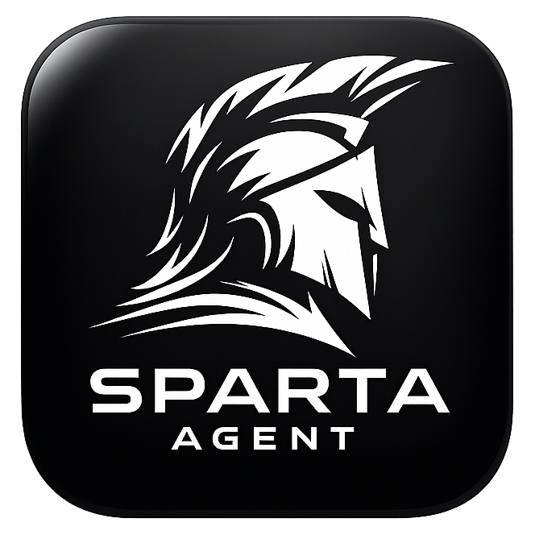
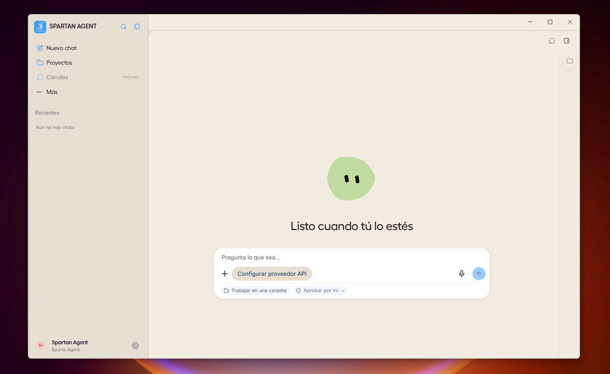

<div align="center">
  
  <h1>Sparta Agent</h1>
  <p><strong>Un espacio de trabajo para construir software con agentes, proveedores de IA por API y control humano.</strong></p>

  <p>
    <a href="https://github.com/Naiker12/Sparta-Agent/releases"></a>
    
    
    
  </p>
</div>

---

<div align="center">
  
</div>

---

> **Conectado por API, con control local.** Sparta Agent combina chat, herramientas y contexto de proyecto en una aplicación de escritorio. Las acciones que afectan archivos o comandos pasan por un control explícito.

## En un vistazo

| Para | Sparta Agent aporta |
| --- | --- |
| Trabajar con tu código | Chat orientado a tareas, contexto de proyecto, diffs y una terminal integrada. |
| Usar IA | Conexiones por API con proveedores remotos o servidores locales externos compatibles con OpenAI. |
| Conectar servicios | Integraciones mediante Model Context Protocol (MCP), con conectores locales, HTTP y stdio. |
| Mantener el control | Aprobaciones antes de acciones sensibles y almacenamiento local protegido de credenciales. |

## Empieza aquí

Descarga el instalador desde las [releases](https://github.com/Naiker12/Sparta-Agent/releases). En el primer arranque, Sparta Agent prepara su motor local en su propio directorio de datos y muestra el progreso; no reutiliza la instalación de otra aplicación.

Para desarrollo:

```bash
git clone https://github.com/Naiker12/Sparta-Agent.git
cd Sparta-Agent
npm ci
npm --prefix desktop/frontend-spartan ci
npm run dev
```

Requisitos: Node.js 20 o posterior y npm 10 o posterior. El motor Python local se prepara desde la aplicación cuando es necesario.

---

## Capacidades

- **Sesiones de trabajo:** chat normal o temporal, selección de modelo y gestión de contexto.
- **Herramientas con permiso:** revisión de cambios, acciones sobre archivos y terminal con confirmación previa.
- **Documentos:** creación de PDF, Excel, Word, CSV, TXT y Markdown mediante una herramienta propia, incluso con Código desactivado; previsualización y descarga en el chat. Requiere un modelo compatible con herramientas.
- **Proyectos y Git:** conexión directa de carpetas, prevención de proyectos duplicados y revisión de cambios, ramas y pull requests en el panel compartido de archivos.
- **Búsqueda web:** herramienta ejecutada por Sparta cuando la activas y el modelo solicita usarla; disponible también con servidores locales compatibles.
- **MCP:** Git, sistemas de archivos, bases de datos, navegador y otros servicios configurables.
- **Modo sin conexión:** los proveedores remotos no se presentan como disponibles cuando no hay conectividad.

---

## Arquitectura

| Capa | Responsabilidad | Tecnología principal |
| --- | --- | --- |
| Aplicación | Interfaz, conversaciones y estados de la sesión | React, Vite, Tailwind |
| Escritorio | Ventana, ciclo de vida, permisos e IPC aislado | Electron + ContextBridge |
| Motor local | API, preparación de dependencias y ejecución local | Python |
| Integraciones | Modelos, conectores y herramientas externas | MCP, REST y stdio |

La interfaz no recibe acceso directo al sistema operativo: las operaciones de escritorio pasan por un puente IPC acotado y el proceso principal es quien las autoriza.

---

## Seguridad y privacidad

| Control | Aplicación |
| --- | --- |
| Confirmación de acciones | Las operaciones que pueden modificar archivos o lanzar comandos requieren aprobación. |
| Alcance de archivos | Las rutas se validan contra el espacio de trabajo autorizado. |
| Secretos | Las credenciales se guardan localmente mediante el almacenamiento seguro de Electron cuando está disponible. |
| Ejecución local | El runtime del backend vive en los datos de Sparta Agent, separado de instalaciones de terceros. |

---

## Qué ocurre cuando envías un mensaje

1. Escribes una consulta y eliges un modelo de un proveedor remoto o de un servidor local externo.
2. Sparta Agent prepara la conversación, las instrucciones y, solo cuando corresponde, el resultado de herramientas que autorizaste.
3. La solicitud se envía a la API configurada: HTTPS para proveedores remotos o la URL del servidor externo que hayas conectado.
4. La respuesta vuelve a la aplicación, se muestra en el chat y se guarda en el historial local según tus preferencias.
5. Si el modelo propone una acción sobre archivos, terminal o MCP, la aplicación muestra el alcance para que puedas aprobarla o rechazarla.

El código y los archivos no se envían "por defecto" a todos los proveedores. Sin embargo, cualquier contenido incluido en una petición —texto, adjuntos, fragmentos de archivos o resultados de herramientas— sí se comparte con el proveedor seleccionado. Usa credenciales de trabajo con permisos mínimos, revisa los límites de gasto y consulta la política de datos del proveedor antes de usar información sensible.

## Lo que esta edición no incluye

Sparta Agent es **API-only** para la inferencia de IA. Puede conectarse a LM Studio, Ollama, llama.cpp o vLLM que ya estén ejecutándose fuera de la aplicación, pero no instala ni administra esos servidores, ni carga sus pesos. El paquete no incluye:

- motores de entrenamiento, Torch o Transformers.
- runtimes de Ollama, LM Studio, llama.cpp o vLLM, ni pesos GGUF o servidores de modelos integrados.
- Whisper local, transcripción basada en modelos descargados ni exportación de pesos.
- RAG local, embeddings, índices vectoriales o bases de conocimiento locales.

El runtime Python administrado continúa presente porque las herramientas de proyecto, automatización y terminal pueden necesitarlo. No es un motor de IA y no descarga pesos de modelos. Esta separación reduce el tamaño del paquete, el uso de disco y los problemas de compatibilidad de GPU.

---

## MCP e IA

Sparta Agent usa el estándar Model Context Protocol para conectar Git, sistemas de archivos, bases de datos, herramientas de navegador y servicios configurables. Los conectores pueden operar por procesos locales, HTTP o stdio.

Los modelos se consumen por API, desde proveedores remotos o servidores locales externos. Puedes guardar una conexión sin escribir IDs de modelos y consultar los disponibles desde su URL. Sparta no descarga ni carga pesos de modelos. Consulta la [guía de conexiones, documentos y proyectos](docs/desktop-workflow.md).

## Límites y decisiones operativas

| Situación | Qué esperar | Recomendación |
| --- | --- | --- |
| Sin conexión a internet | Los proveedores remotos y la búsqueda web necesitan conectividad; un servidor local ya preparado puede seguir atendiendo el chat. | Mantén el servidor externo activo y selecciona una conexión local. |
| Credencial inválida o cuota agotada | El proveedor devolverá un error de autenticación, permisos o límite. | Renueva la clave, revisa el plan y prueba con un modelo habilitado. |
| Archivo sensible | Puede terminar incluido en la solicitud si lo adjuntas o permites que una herramienta lo lea. | Aplica revisiones, minimiza el contexto y usa un proveedor aprobado por tu organización. |
| Cambio sobre el workspace | La acción se detiene para pedir permiso cuando aplica. | Lee la ruta, el diff o el comando antes de aprobar. |
| Modelo sin soporte de herramientas | El chat sigue disponible, pero algunas acciones no. | Usa un modelo y proveedor con soporte explícito de herramientas si necesitas modo agente. |

---

## Comandos de mantenimiento

```bash
npm run typecheck      # Comprueba TypeScript
npm run lint           # Ejecuta el linter
npm test               # Ejecuta las pruebas
npm run landing:build  # Construye la landing
npm run build          # Empaqueta la aplicación de escritorio
```

---

## Estructura del Proyecto

```text
desktop/
  frontend-spartan/     # Aplicación React
  backend-spartan/      # Motor Python local
  ia-sparta-app-shell/  # Proceso principal de Electron
  ia-sparta-ipc-bridge/ # API IPC expuesta al renderer
docs/                   # Guías, capturas y notas de versión
landing/                # Sitio público
tests/                  # Pruebas del proyecto
```

---

## Contribuir y soporte

Los problemas, ideas y propuestas son bienvenidos en los [issues](https://github.com/Naiker12/Sparta-Agent/issues). Antes de abrir un cambio, ejecuta los comandos de validación anteriores y conserva los límites entre renderer, IPC y proceso principal.

## Licencia

Sparta Agent se distribuye bajo la licencia [MIT](LICENSE).
