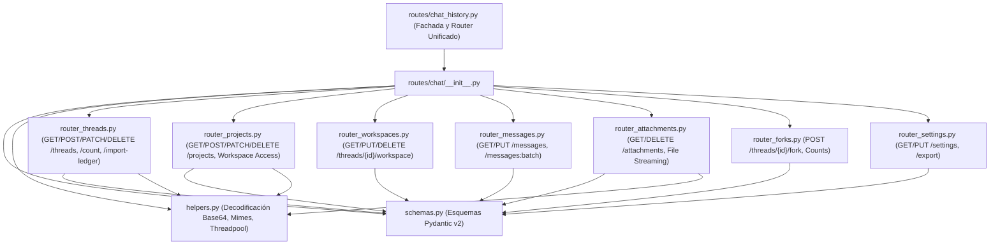

# Arquitectura Modular de Rutas de Chat (`routes.chat`)

Este paquete contiene la descomposición modular de las rutas HTTP y endpoints de historial de conversaciones de Spartan Agent, anteriormente centralizadas en un monolito de más de 1,500 líneas en `routes/chat_history.py`.

---

## 1. Diagrama de Arquitectura de Rutas

---

## 2. Inventario de Sub-Routers y Responsabilidades

| Módulo | Líneas | Endpoints REST | Responsabilidad Única (SRP) |
| :--- | :---: | :---: | :--- |
| [`schemas.py`](file:///d:/sparta-agent/desktop/backend-spartan/routes/chat/schemas.py) | 505 | — | Definición de modelos Pydantic: `ChatThread`, `ChatMessage`, `ChatProject`, `ChatSettingsPayload`, `ChatPresetLoadConfig`, `ChatForkResponse`, etc. |
| [`helpers.py`](file:///d:/sparta-agent/desktop/backend-spartan/routes/chat/helpers.py) | 260 | — | Sanitización de settings no legibles (`_unreadable_thread_settings`), decodificación segura base64 de adjuntos, filtrado MIME y limpieza asíncrona de sandboxes en threadpool. |
| [`router_threads.py`](file:///d:/sparta-agent/desktop/backend-spartan/routes/chat/router_threads.py) | 224 | 7 | `GET /threads`, `POST /threads`, `GET /threads/{id}`, `PATCH /threads/{id}`, `DELETE /threads`, `GET /count`, `GET/POST /import-ledger`, `DELETE /`. |
| [`router_projects.py`](file:///d:/sparta-agent/desktop/backend-spartan/routes/chat/router_projects.py) | 240 | 6 | `GET /projects`, `POST /projects`, `GET /projects/{id}`, `PATCH /projects/{id}`, `PATCH /projects/{id}/workspace`, `DELETE /projects/{id}`. |
| [`router_workspaces.py`](file:///d:/sparta-agent/desktop/backend-spartan/routes/chat/router_workspaces.py) | 48 | 3 | `GET /threads/{id}/workspace`, `PUT /threads/{id}/workspace`, `DELETE /threads/{id}/workspace`. |
| [`router_messages.py`](file:///d:/sparta-agent/desktop/backend-spartan/routes/chat/router_messages.py) | 120 | 5 | `GET /threads/{id}/messages`, `POST /messages:batch`, `GET /threads/{id}/messages/{msg_id}`, `PUT /threads/{id}/messages/{msg_id}`, `PUT /threads/{id}/messages`. |
| [`router_attachments.py`](file:///d:/sparta-agent/desktop/backend-spartan/routes/chat/router_attachments.py) | 135 | 3 | `GET /attachments` (paginado), `GET /attachments/{msg_id}/{att_id}/file`, `DELETE /attachments/{msg_id}/{att_id}`. |
| [`router_forks.py`](file:///d:/sparta-agent/desktop/backend-spartan/routes/chat/router_forks.py) | 88 | 3 | `POST /threads/{id}/fork`, `GET /threads/{id}/messages/{msg_id}/forks`, `GET /threads/{id}/forks`. |
| [`router_settings.py`](file:///d:/sparta-agent/desktop/backend-spartan/routes/chat/router_settings.py) | 55 | 3 | `GET /settings`, `PUT /settings`, `GET /export`. |
| [`__init__.py`](file:///d:/sparta-agent/desktop/backend-spartan/routes/chat/__init__.py) | 20 | — | Barril unificador de esquemas, helpers y sub-routers. |

---

## 3. Compatibilidad 100% Retroactiva

[`routes/chat_history.py`](file:///d:/sparta-agent/desktop/backend-spartan/routes/chat_history.py) mantiene la instancia original `router = APIRouter()`, registrando directamente los 32 endpoints y re-exportando todas las funciones, modelos y excepciones para que ningún import en tests o servicios externos requiera modificación.
