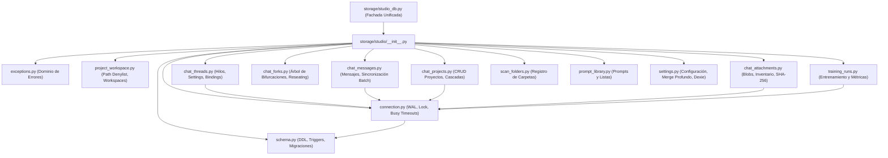

# Arquitectura Modular de Almacenamiento SQLite (`storage.studio`)

Este paquete contiene la implementación modular del almacenamiento SQLite de Sparta Studio (`studio.db`), anteriormente un monolito de más de 4,000 líneas en `storage/studio_db.py`.

Cada responsabilidad del ciclo de vida de persistencia, concurrencia, árboles de conversación y seguridad del sistema de archivos ha sido separada siguiendo el Principio de Responsabilidad Única (SRP) y patrones de diseño limpios.

---

## 1. Diagrama de Arquitectura de Módulos

---

## 2. Mapa de Responsabilidades

| Módulo | Responsabilidad Principal |
| :--- | :--- |
| [`exceptions.py`](file:///d:/sparta-agent/desktop/backend-spartan/storage/studio/exceptions.py) | Clases de excepción de dominio (`ProjectWorkspaceError`, `ChatThreadDeletedError`, `ChatMessageConflictError`, etc.). |
| [`connection.py`](file:///d:/sparta-agent/desktop/backend-spartan/storage/studio/connection.py) | Apertura de conexión SQLite, modo WAL, `PRAGMA foreign_keys = ON`, manejo de contención multihilo y cerrojo `_schema_lock`. |
| [`schema.py`](file:///d:/sparta-agent/desktop/backend-spartan/storage/studio/schema.py) | Creación de 29 tablas, índices compuestos, triggers para inventario y migraciones DDL idempotentes. |
| [`project_workspace.py`](file:///d:/sparta-agent/desktop/backend-spartan/storage/studio/project_workspace.py) | Denylist de carpetas del sistema operativo (Windows, Linux, macOS), validación de sandboxes y borrado seguro de workspaces. |
| [`chat_projects.py`](file:///d:/sparta-agent/desktop/backend-spartan/storage/studio/chat_projects.py) | Creación, actualización y eliminación de proyectos, reparenting de bifurcaciones y detención de research runs activas. |
| [`chat_threads.py`](file:///d:/sparta-agent/desktop/backend-spartan/storage/studio/chat_threads.py) | Operaciones sobre hilos de conversación, vinculación de carpetas de trabajo y persistencia atómica de configuración por pestaña. |
| [`chat_messages.py`](file:///d:/sparta-agent/desktop/backend-spartan/storage/studio/chat_messages.py) | Sincronización en lotes de mensajes (`sync_chat_messages`), protección de prompts de investigación y reconciliación de subidas. |
| [`chat_forks.py`](file:///d:/sparta-agent/desktop/backend-spartan/storage/studio/chat_forks.py) | Clonación atómica de ancestros (`fork_chat_thread`), conteo de ramas y reconexión de mensajes protegidos (`_reseat_protected_messages`). |
| [`chat_attachments.py`](file:///d:/sparta-agent/desktop/backend-spartan/storage/studio/chat_attachments.py) | Detección de blobs base64 / data URIs, hashing SHA-256 de parts de contenido, inventario normalizado y paginación. |
| [`training_runs.py`](file:///d:/sparta-agent/desktop/backend-spartan/storage/studio/training_runs.py) | Persistencia de estados de entrenamiento, inserción por lotes de métricas (`training_metrics`) y limpieza de ejecuciones huérfanas. |
| [`scan_folders.py`](file:///d:/sparta-agent/desktop/backend-spartan/storage/studio/scan_folders.py) | Registro y validación de carpetas locales de modelos de inferencia. |
| [`prompt_library.py`](file:///d:/sparta-agent/desktop/backend-spartan/storage/studio/prompt_library.py) | Repositorio de biblioteca de prompts individuales y listas de prompts del usuario. |
| [`settings.py`](file:///d:/sparta-agent/desktop/backend-spartan/storage/studio/settings.py) | Ajustes globales, fusión profunda (`_deep_merge_settings`) de preferencias de chat y ledger de migración de Dexie. |

---

## 3. Compatibilidad Retroactiva

[`storage/studio_db.py`](file:///d:/sparta-agent/desktop/backend-spartan/storage/studio_db.py) actúa como fachada transparente re-exportando el 100% de la API pública y privada previa, manteniendo compatibilidad total sin requerir cambios en ningún router o servicio existente.
