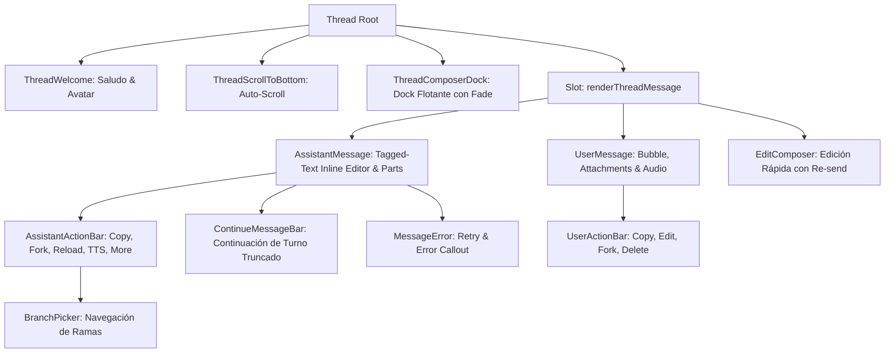

# Submódulo: Thread (`src/components/assistant-ui/thread/`)

Este submódulo contiene los componentes desacoplados, gestores de ciclo de vida y estado visual del visor de conversaciones (`Thread`) en Sparta Agent.

---

## 1. Arquitectura y Flujo de Componentes del Chat y Mensajes

---

## 2. Responsabilidad por Archivo (Clean Code & SRP)

| Archivo | Líneas | Responsabilidad Única (SRP) |
| :--- | :---: | :--- |
| **`prompt-queue-types.ts`** | ~45 | Contratos de interfaces: `PromptQueueTarget`, `PromptQueueItem`, `PromptQueueRun`, `PromptQueueCallbacks` y constantes de sondeo. |
| **`prompt-queue-manager.ts`** | ~280 | Lógica pura del motor de cola: ciclo de vida de ejecuciones, sondeo por turnos, round-robin multi-hilo, detección de RAG y suscripción global a `runningByThreadId`. |
| **`prompt-queue-stack.tsx`** | ~240 | Componente React para renderizar la pila flotante de prompts encolados, edición en línea, eliminación y reordenamiento accesible. |
| **`reasoning-toggle.tsx`** | ~280 | Selector de esfuerzo de pensamiento (`ReasoningToggle`, `PillGlyph`, `ThinkIcon`): maneja modos de razonamiento, preserve-thinking y compatibilidad de modelos. |
| **`tool-toggles.tsx`** | ~240 | Botones interactivos (pills) para herramientas del composer: `WebSearchToggle`, `CodeToolsToggle`, `ImagesToggle`, `ArtifactsToggle` y el indicador en tiempo real `ToolStatusDisplay`. |
| **`composer-tools-menu.tsx`** | ~320 | Menú desplegable principal (`+`): adjuntos de imágenes/audio/documentos con filtros MIME, proyectos recientes, prompts guardados, deep research, lienzo y exportación. |
| **`composer-right-controls.tsx`** | ~220 | Barra de acción derecha del composer: botón inteligente de envío/encolado, dictado por voz, parada de generación y cancelación de deep research. |
| **`use-ime-composer.ts`** | ~180 | Hook y utilidades de composición de texto (`useImeComposerInputHandlers`): watchdog contra IME atascado en Chrome/WSL/macOS y atajos de teclado. |
| **`thread-scroll-to-bottom.tsx`** | ~35 | Botón flotante accesible para desplazarse al final del historial de mensajes sin interferir con el MutationObserver de la librería base. |
| **`thread-welcome.tsx`** | ~170 | Pantalla de inicio con saludo personalizado según la hora del día, rotación periódica de avatar mascot y soporte para sesiones efímeras (incógnito). |
| **`thread-composer-dock.tsx`** | ~110 | Dock inferior absoluto con gradiente de desvanecimiento superior, nota de descargo del modelo y observador de tamaño para reservar espacio en el viewport. |
| **`message-action-hooks.ts`** | ~230 | Hooks compartidos para operaciones sobre mensajes: bifurcación atómica de hilos (`useForkMessageAction`), suscripción a forks, detección de deep research activo, accesibilidad de foco y exportación a markdown. |
| **`assistant-action-bar.tsx`** | ~350 | Barra de herramientas interactiva para mensajes: copia al portapapeles, eliminación con parada de TTS, lectura en voz alta, selector de ramas (`BranchPicker`) y menú desplegable secundario sin bloqueo modal del DOM. |
| **`assistant-message-view.tsx`** | ~480 | Componentes visuales de mensajes: `AssistantMessage`, `UserMessage`, `EditComposer`, `ThreadMessage`, indicadores de generación/cancelación, barra de continuación y tabla de herramientas confirmables. |
| **`index.ts`** | ~25 | Barril unificado de exportación para consumo interno y externo. |

---

## 3. Algoritmos y Patrones Clave

### A. Tagged-Text Inline Editor (`extractTaggedText`)
Permite editar mensajes generados por IA que contienen bloques estructurados `<THINK>` o llamadas `<TOOL>` directamente dentro de un `textarea` plano sin romper el esquema de datos subyacente.

### B. Continuación de Turno Truncado (`ContinueMessageBar`)
Si la generación se detiene por límite de tokens (`max_tokens`) o corte de red, permite reanudar la respuesta exactamente desde el último carácter generado (`CONTINUATION_RUN_CONFIG_KEY`), transportando la firma criptográfica de pensamiento (en modelos Gemini) sin necesidad de regenerar el turno completo.

### C. Revelación Accesible de Acciones en Mensajes Ocultos (`useActionBarFocusReveal`)
Resuelve el problema de accesibilidad de `autohide="not-last"`: cuando un usuario navega con teclado (Tab/Shift+Tab), detecta el foco entrante y monta reactivamente la barra de acciones antes de que el evento de teclado salte al siguiente mensaje.
