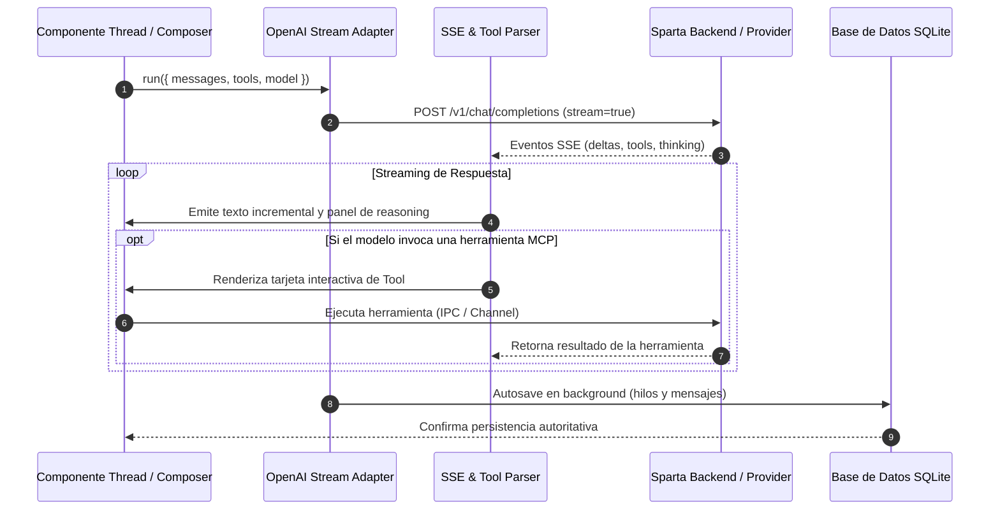

# Módulo Chat Adapter: Inferencia, Streaming y Herramientas

## 1. Propósito y Responsabilidad

El módulo **Chat Adapter** es el núcleo de comunicación entre el runtime de interfaz de usuario (`@assistant-ui/react`) y los motores de inferencia (tanto servidores locales basados en `llama.cpp` como proveedores externos como OpenAI, Anthropic, Gemini y OpenRouter).

### Objetivos Clave:
- Implementar el protocolo de streaming Server-Sent Events (SSE) en tiempo real.
- Gestionar el ciclo de vida completo de herramientas MCP (Model Context Protocol) y herramientas del Sandbox.
- Extraer y procesar contenidos multimodales (imágenes en base64, notas de voz y fragmentos de video).
- Controlar el guardado automático (*autosave*) transparente y asíncrono para que ninguna respuesta se pierda.
- Serializar mensajes respetando contratos estrictos de proveedores (OpenAI, Anthropic y Google Gemini).
- Calcular métricas precisas de latencia, primer token y rendimiento (tokens por segundo).

---

## 2. Diagrama de Arquitectura y Flujo

---

## 3. Algoritmos y Lógica Clave

### A. Parser Incremental de Argumentos de Herramientas (`tool-args-parser.ts`)
Para que el usuario no espere a que el modelo termine de escribir un objeto JSON complejo de herramienta, se implementa `parseLiveToolArgs`. Utiliza un analizador parcial de JSON que tolera estructuras incompletas para renderizar la tarjeta gráfica de la herramienta mientras los parámetros aún se están escribiendo token por token.

### B. Serialización y Normalización de Mensajes (`message-serialization.ts`)
Convierte los mensajes internos de `@assistant-ui/core` al formato compatible con OpenAI Chat Completions:
- Separa y mapea partes de texto, imágenes, reasoning codex y llamadas a funciones.
- Asegura que los turnos del asistente con únicamente llamadas a herramientas tengan `content: null` (requerimiento estricto de Gemini y OpenAI).
- Descarta silenciosamente pares de turnos rechazados (`anthropic_refusal`) para evitar que el contexto de Anthropic continúe en bucle de rechazo.

### C. Métricas de Inferencia y Tiempo (`stream-timing.ts`)
Calcula en tiempo real métricas de calidad de experiencia:
- `firstTokenTime`: Tiempo transcurrido hasta el primer token generado (TTFT).
- `tokensPerSecond`: Velocidad real de generación excluyendo la latencia de inicialización del modelo.
- `estimateTokenCount`: Estimador rápido basado en longitud de caracteres para cotización preliminar de ventanas KV.

### D. Desempaquetado de Salidas MCP (`tool-results.ts`)
`toolResultModelText` garantiza que el modelo reciba únicamente el texto puro del resultado, evitando la contaminación del contexto con metadatos internos de sesión o tarjetas gráficas.

### F. Ensamblado Compuesto de Prompts y Workspaces (`prompt-assembly.ts`)
Orquesta la inyección contextual previa al completion:
- Inyecta de forma segura el contexto de workspace (`<thread_workspace>`) protegiendo las rutas locales absolutas del usuario contra fugas.
- Recupera y asocia dinámicamente las directivas personalizadas del proyecto (`<project_instructions>`).
- Sincroniza el idioma nativo de respuesta con el locale del usuario en la interfaz.

### G. Máquina de Estados de Autocarga y Respaldo (`auto-load.ts`)
Maneja el ciclo de vida y autocarga inteligente cuando el usuario no ha seleccionado un modelo:
- Detecta arquitecturas locales (`safetensors`, `GGUF`, variantes cuantizadas MXFP/Q4_K).
- Previene la carga de modelos de difusión o tareas de imagen/video en la interfaz de chat.
- Coordina la recuperación y descarga automática de modelos ligeros (`Gemma 4 E2B`) cuando el dispositivo no dispone de modelos cacheados.
- Preserva el estado y los parámetros de inferencia entre hilos (`snapshotVisibleModelState` y `restoreVisibleModelState`).

### H. Orquestador de Streaming Asíncrono y Tools (`stream-orchestrator.ts`)
Implementa el contrato principal `createOpenAIStreamAdapter` requerido por `@assistant-ui/react`:
- Coordina el canal SSE de streaming con control estricto de reintentos, cancelaciones (`AbortSignal`) y reconexiones.
- Gestiona el despacho y renderizado reactivo de llamadas a herramientas (MCP, Workspace, Sandbox, Research).
- Sincroniza en tiempo real los estados visuales del generador (`setGeneratingStatus`, `setToolStatus`, `clearToolConfirmation`).

---

## 4. Dependencias y Librerías Utilizadas

- **`@assistant-ui/react`**: Contratos del adaptador de modelo (`ChatModelAdapter`) y tipos de mensajes.
- **`assistant-stream`**: Utilidades para el parseo seguro de fragmentos JSON parciales (`parsePartialJsonObject`).
- **Zustand (`chat-runtime-store`)**: Lectura reactiva de los parámetros de inferencia, reasoning y configuraciones de GPU/CPU.
- **FastAPI / Fetch API**: Canal HTTP de transporte seguro con control de señales de cancelación (`AbortSignal`).

---

## 5. Mapa de Archivos del Módulo

| Archivo | Líneas | Responsabilidad Única (SRP) |
| :--- | :---: | :--- |
| **`autosave-handle.ts`** | ~46 | Coordinación del guardado inicial en background y timeouts. |
| **`context-limits.ts`** | ~122 | Detección de colapso de ventana KV y formateo de URLs seguras. |
| **`tool-args-parser.ts`** | ~36 | Parseo tolerante de JSON parcial para streaming de tools. |
| **`tool-results.ts`** | ~54 | Normalización y desempaquetado de resultados MCP y sandbox. |
| **`multimodal-detection.ts`** | ~100 | Detección e inspección de imágenes, clips de voz y videos. |
| **`token-counting.ts`** | ~137 | Inyección de parámetros de tokens, razonamiento y RAG. |
| **`stream-timing.ts`** | ~35 | Cálculo de métricas de inferencia, latencia y tokens/segundo. |
| **`message-serialization.ts`**| ~450 | Serialización estructurada de mensajes, tools y reasoning para OpenAI. |
| **`prompt-assembly.ts`** | ~235 | Ensamblado de system prompts, directivas de workspace, idioma e instrucciones de proyecto. |
| **`auto-load.ts`** | ~1,390 | Máquina de estados de autocarga, snapshots de modelo y descarga coordinada. |
| **`stream-orchestrator.ts`**| ~3,200 | Bucle SSE del adaptador (`createOpenAIStreamAdapter`) y despacho de eventos MCP. |
| **`model-autoload-selection.ts`**| ~50 | Algoritmo de resolución y selección de modelos locales. |
| **`replay-content.ts`** | ~55 | Reconstrucción de historial y firmas de reasoning. |
| **`system-prompt.ts`** | ~95 | Resolución de variables temporales y dinámicas del prompt. |
| **`index.ts`** | ~36 | Barril unificado de exportación pública. |

