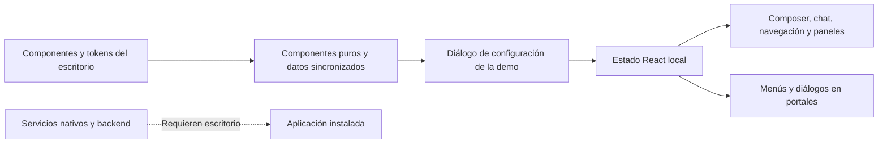

# Configuración del escritorio y adaptación de la demo

## Fuente y límites de la revisión

Se revisó el registro de pestañas de `desktop/frontend-spartan/src/features/settings/settings-dialog.tsx`, sus diez pestañas activas y los componentes auxiliares de perfil, proveedores, apariencia, atajos, datos y registros. La captura del usuario se usa como referencia visual; los datos de su escritorio no se reproducen en la landing.

La demo adapta la presentación y los recorridos locales. No importa los stores de autenticación, preferencias persistentes ni clientes del backend. No escribe en las preferencias del escritorio. Recursos, voz y agentes tienen archivos de pestaña, pero no forman parte de la navegación activa del diálogo revisado.

## Organización verificada

| Pestaña | Aplicación de escritorio | Adaptación implementada |
| --- | --- | --- |
| General | Versión, idioma, permisos, inicio y bandeja, restablecimiento | Versiones; español; permisos sincronizados con el composer; restablecimiento confirmado de las preferencias locales, incluidos los parámetros de respuesta, conservando los chats |
| Perfil | Personalización, catálogo de avatares, estadísticas del perfil | Nombre de hasta 200 caracteres, los 28 avatares originales, avatar de bienvenida y recuentos locales |
| Apariencia | Temas y paletas, colores, fuentes, contraste, tamaños y personalización de barra | Claro, oscuro y sistema; tres paletas originales; colores personalizados por modo; fuentes, contraste, tamaños, cursor, suavizado y movimiento; siete secciones fijables y reordenables por arrastre o teclado |
| Chat | Parámetros de inferencia, opciones del composer y valores predeterminados del chat | Filas con etiquetas, descripciones y controles compactos; parámetros originales recordados por modelo; siete elementos fijables en el menú +; agrupación por proyectos, aviso y modelo de respuesta, títulos automáticos, ámbito de adjuntos, pegados largos, avatar y Enter |
| API | Crear, revelar y revocar claves de acceso a la API de Sparta | Crear, revelar, ocultar y revocar tokens locales expresamente inválidos; confirmación de revocación |
| Conexiones | Proveedores externos, endpoint, credenciales y modelos | Añadir, editar y quitar metadatos locales; validación de URL; campo de credencial desactivado; MCP conectado al composer de ejemplo |
| Datos | Administrar y archivar chats, exportaciones, importación y archivos | Administrar, archivar y restaurar los chats de la demo; exportar nombres, archivo e historial local a JSON |
| Atajos | Cinco acciones globales y edición de combinaciones | Cinco definiciones oficiales sincronizadas desde el código; búsqueda; lista de controles web disponibles |
| Registros | Fuentes de logs del escritorio, actualización y copia | Capturar y copiar un diagnóstico local con fecha, tema, perfil y origen de respuestas |
| Acerca de | Versión, ayuda, licencia y datos nativos | Versión, documentación, notas, incidencias y licencia |

**Corrección de arquitectura:** API no es el gestor de proveedores. Este pertenece a Conexiones. Se corrigió la confusión de la primera implementación de la demo.

## Reutilización y aislamiento

- `SettingsSection`: se utiliza el componente original para títulos, descripción y agrupación de controles.
- `Switch`: se utiliza el componente original del escritorio, con tamaño de 32 × 18,4 px y colores locales al tema de la demo.
- `GeneratedAvatar` y `BLOBATAR_AVATARS`: componente y catálogo originales, sin copiar semillas distintas.
- `DEFAULT_INFERENCE_PARAMS`: valores originales. Editar el formulario de parámetros no cambia el contenido de las respuestas predeterminadas; la interfaz lo indica.
- `SHORTCUT_DEFS`: se genera una adaptación durante `demo:sync`, evitando importar el grafo de traducciones y stores del escritorio. El script comprueba que el registro esperado siga siendo el de cinco acciones.
- Base UI gestiona el diálogo, el foco y Escape. Los paneles con datos propios se mantienen montados para conservar su estado al cambiar de sección o cerrar y volver a abrir el diálogo.
- Un contexto React local lleva colores y tipografías a la superficie y a sus portales. Los modos Sistema de tema y movimiento escuchan los cambios de las preferencias del sistema.
- Las paletas se generan desde el CSS del escritorio durante `demo:sync`; no se copian colores aproximados de las capturas. Se reutilizan los archivos de Inter Variable, Figtree, Space Grotesk y los pesos originales de Hellix.
- El adaptador `DemoSettingRow` reproduce la disposición envolvente de `SettingsRow` sin importar sus servicios de tooltip.

## Diferencias que siguen siendo deliberadas

La demo no implementa estadísticas reales de tokens, importación de fuentes, ejecución de Canvas/HTML, comparación de conversaciones, descubrimiento de modelos, pruebas de proveedores, credenciales, importación de conversaciones reales, carpetas vinculadas, grabación de atajos ni visor de archivos de logs. Las funciones nativas necesitan el escritorio. No se presenta esta adaptación como un duplicado completo de su configuración.

## Barra lateral y desplazamiento

Se añadió el menú Más con las siete secciones del personalizador: Proyectos, Audio, Recetas, Exportar, API, Memoria y Tareas. Audio se identifica como función del escritorio; las otras secciones disponibles usan datos locales. Se pueden fijar y reordenar. También se añadieron chats de proyecto separados de Recientes; acciones de fijar, más y renombrar; archivo recuperable desde Datos; y apertura de Configuración desde el engranaje del perfil. El artefacto de archivo utiliza el azul del escritorio. Las barras de desplazamiento de conversación, paneles y diálogo usan una pista transparente y un pulgar fino, sin flechas nativas.

## Validación

Compilación TypeScript y Vite con `npm run build:gh`. Revisión en navegador de catálogo de 28 avatares, diez secciones, búsqueda por «temperatura», interruptores originales, temas claro y oscuro, creación/revelado/revocación de token inválido, conservación de datos entre pestañas, conexión local, archivo/restauración y captura de diagnóstico. Se comprobó el diálogo a 1280 × 900 y a 390 × 844: las diez pestañas permanecen accesibles, el contenido se desplaza dentro de su panel y los campos no desbordan horizontalmente.

Comprobaciones adicionales:

- Fijar API crea su botón en la navegación; la reordenación con ArrowUp cambia el orden de las secciones.
- Ocultar Proyectos traslada su chat a Recientes; ocultar el aviso lo retira del composer; activar el modelo muestra el valor capturado para esa respuesta.
- Fijar Exportar chat lo mueve al primer nivel del menú +.
- Temperatura de free = 0,3; cambiar a Claude muestra 0,6; editar Claude y volver a free recupera 0,3.
- Restablecer preferencias devuelve la temperatura a 0,6.
- Un pegado de 2340 caracteres, con umbral 2000, crea `texto-pegado.txt` y conserva vacío el composer; el chip refleja el ámbito Conversación.
- Un primer mensaje titula el chat cuando la opción está activa.
- El indicador de contexto ya no hereda el ancho de 7 px del antiguo punto animado: el texto en pausa ocupó 507 × 18 px y su fondo fue transparente.
- Seleccionar Georgia y tamaño 18 se refleja en la fuente calculada del composer: `Georgia, serif`, 18 px.
- Las paletas Clásica clara y Minimalista oscura muestran los valores de sus bloques de CSS originales.
- La consola no registró errores ni advertencias en los recorridos revisados.

El control de exportación prepara el JSON y activa la descarga normal del navegador. El navegador integrado no devolvió un evento de descarga al mecanismo de automatización; no se certifica la escritura del archivo descargado.

Capturas: `artifacts/landing-redesign/desktop-settings-appearance-final.png`, `desktop-settings-chat-final.png` y `mobile-settings-chat-final.png`. Documentación comprobada: 29 páginas, 39 enlaces internos.

## Segunda revisión de los cinco recorridos

1. **Perfil:** apodo, forma circular o redondeada y foto local. Se reutiliza directamente `resizeImageFileToDataUrl` del escritorio, con sus límites de tamaño y preservación de transparencia. El avatar se refleja en Perfil, saludo y pie de navegación; elegir uno de los 28 avatares retira la foto. No se guarda en el perfil instalado ni se envía al servidor.
2. **Composer:** admite hasta 20 000 caracteres; crece hasta 180 px y desplaza el texto dentro del campo. Al vaciarlo vuelve a 48 px. Nuevo chat espera una entrada del usuario en lugar de reiniciar automáticamente la reproducción. El dictado sigue identificado como función del escritorio.
3. **Thinking y respuestas:** se verificaron expansión, parada y continuación con Claude; se mantiene el pipeline Markdown del escritorio. La copia de razonamiento se limita al fragmento mostrado cuando sigue pendiente.
4. **Panel lateral:** se preserva la indentación al retirar los marcadores del diff. Se verificaron búsqueda de `validation.ts` y cambio de ancho por teclado de 300 a 324 px.
5. **Revisión visual:** Perfil móvil tiene 341 px de ancho útil y 341 px de contenido; composer móvil, 251 px para ambas medidas. Un mensaje de 1344 caracteres ocupó 180 px de alto, con scroll interno de 600 px; vaciarlo restauró 48 px. Una imagen de prueba local se redujo a 256 × 180 px y se pudo retirar. Consola sin errores ni advertencias en estos recorridos.

Capturas adicionales: `desktop-profile-complete.png`, `mobile-profile-complete.png`, `mobile-composer-final.png`, dentro de `artifacts/landing-redesign/`.

## Flujo de la adaptación

