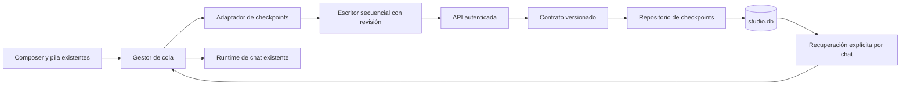

# Paso 5: persistencia y recuperación de la cola del chat

Esta entrega conecta la cola existente de escritorio con SQLite a través de la API autenticada. Complementa el [mapa de estructura](./2026-10-02-durable-work-structure.md); no sustituye el ejecutor del chat ni activa trabajo con la aplicación apagada.

## Comportamiento implementado

- La cola se guarda incluso mientras espera que termine una respuesta anterior.
- Cada pendiente conserva texto, ID, orden y una copia independiente de su configuración de modelo, herramientas, razonamiento y documentos.
- Editar, eliminar y reordenar pendientes actualiza el checkpoint.
- El registro de envío se confirma antes de invocar el chat. Si no puede guardarse, el despacho espera.
- Al abrir el chat se ofrece **Retomar pendientes** o **Descartar**. La recuperación requiere una acción del usuario.
- Un ítem registrado como enviado no se repite al recuperar. Puede haber quedado registrado antes de que el proveedor recibiera la solicitud: revisar la última respuesta sigue siendo necesario.
- Las conversaciones temporales no se guardan en estos checkpoints, incluyendo un pendiente temporal añadido a una cola ya persistente.
- El acceso `full` se conserva para la ejecución de la sesión actual, pero la copia recuperable usa `ask` y no guarda bypass. Esto respeta la regla existente de acceso completo limitado a la sesión.
- Cerrar sesión retira callbacks y temporizadores del gestor, cancela solicitudes de guardado en curso y conserva el checkpoint del propietario anterior.
- El cambio de proyecto o un conflicto de revisión impiden continuar silenciosamente con otra configuración.
- Borrar el chat elimina sus checkpoints mediante la clave foránea.

## Separación de responsabilidades



El registro genérico `work_runs` permanece separado del checkpoint específico de la cola: todavía no se ha conectado cada turno a sus intentos y eventos genéricos. El checkpoint serializa datos; las funciones, referencias de runtime y temporizadores se reconstruyen en la interfaz.

| Archivo | Responsabilidad |
| --- | --- |
| [prompt_queue_contracts.py](D:/sparta-agent/desktop/backend-spartan/core/prompt_queue_contracts.py) | Versión, tipos, límites, parámetros permitidos y exclusión de acceso completo recuperable |
| [prompt_queues_db.py](D:/sparta-agent/desktop/backend-spartan/storage/prompt_queues_db.py) | Transacción, revisión, retry exacto, aislamiento por usuario y vínculo con chat/proyecto |
| [work_runs_schema.py](D:/sparta-agent/desktop/backend-spartan/storage/work_runs_schema.py) | Tabla adicional `work_prompt_queues` e índice por propietario/conversación |
| [work_runs.py](D:/sparta-agent/desktop/backend-spartan/routes/work_runs.py) | Rutas de consulta y guardado autenticadas; conflicto HTTP 409 |
| [prompt-queues-api.ts](D:/sparta-agent/desktop/frontend-spartan/src/features/chat/api/prompt-queues-api.ts) | Transporte, abort al cerrar sesión y clasificación de errores |
| [queue-checkpoint-writer.ts](D:/sparta-agent/desktop/frontend-spartan/src/features/chat/utils/queue-checkpoint-writer.ts) | Serialización de escrituras y retry del mismo contenido tras respuesta incierta |
| [durable-queue-settings.ts](D:/sparta-agent/desktop/frontend-spartan/src/features/chat/utils/durable-queue-settings.ts) | Copia independiente y tratamiento del permiso limitado a la sesión |
| [prompt-queue-persistence.ts](D:/sparta-agent/desktop/frontend-spartan/src/components/assistant-ui/thread/prompt-queue-persistence.ts) | Convertir el estado vivo en datos serializables; excluir temporales |
| [prompt-queue-manager.ts](D:/sparta-agent/desktop/frontend-spartan/src/components/assistant-ui/thread/prompt-queue-manager.ts) | Conectar checkpoint, despacho, cambios de pendientes y restauración |
| [use-prompt-queue-recovery.ts](D:/sparta-agent/desktop/frontend-spartan/src/components/assistant-ui/thread/use-prompt-queue-recovery.ts) | Ofrecer recuperación explícita y retirar avisos al cambiar de chat o sesión |
| [thread.tsx](D:/sparta-agent/desktop/frontend-spartan/src/components/assistant-ui/thread.tsx) | Preparar la conversación y reconstruir targets con la configuración guardada |

## API y límites

- `GET /api/work-runs/prompt-queues?threadId=...`: checkpoints no vacíos del usuario para ese chat.
- `PUT /api/work-runs/prompt-queues/{queueId}`: `expectedRevision` y `checkpoint` versionado.
- Hasta 100 pendientes por checkpoint, 200.000 caracteres por mensaje y 2 MB de checkpoint serializado. Un exceso devuelve error y bloquea el envío; permite editar o detener la cola.
- Un checkpoint vacío es una marca de finalización o descarte. Conservar la fila permite detectar retries atrasados.
- Los chats y proyectos siguen el contrato compartido de la aplicación. El checkpoint de cola se aísla por propietario; no se inventó un campo de propietario de chat inexistente.
- Los parámetros admitidos no incluyen claves ni tokens de conexiones. El texto escrito por el usuario se guarda como contenido de trabajo y debe tratarse con la misma privacidad que el historial.

## Pruebas y alcance de validación

Resultado final: **58 pruebas de backend y 93 de frontend aprobadas; 151 en total**, además de compilación TypeScript y build de producción correctos.

Se probaron SQLite real y rutas HTTP con base temporal. Las pruebas del gestor ejecutan el manager, el adaptador y el escritor reales, sustituyendo únicamente transporte y runtime de proveedor; no realizan llamadas pagadas ni prueban una instalación nativa.

Casos cubiertos: reinicio, retry tras respuesta perdida, concurrencia por revisión, orden y edición, eliminación, almacenamiento inaccesible, marcador anterior al despacho, recuperación sin repetir enviados, sesión cerrada, chat equivocado, cambios de proyecto, borrado en cascada, permisos de sesión y ausencia de persistencia de temporales. También se verifica que consumir Deep Research no reactive investigación en los siguientes prompts recuperados.

Comandos reproducibles:

```powershell
cd D:/sparta-agent/desktop/backend-spartan
.\.venv\Scripts\python.exe -m pytest --noconftest tests/test_prompt_queue_checkpoints.py tests/test_work_runs_storage.py tests/test_work_runs_api.py tests/test_tasks_redesign.py tests/test_task_preview.py -q --tb=short

cd D:/sparta-agent/desktop/frontend-spartan
node --experimental-strip-types --test tests/prompt-queue-persistence-integration.test.ts tests/queue-checkpoint-writer.test.ts tests/prompt-queue-reorder.test.ts tests/prompt-queue-reorder-sweep.test.ts tests/prompt-queue-model-boundary.test.ts tests/prompt-queue-input.test.ts tests/prompt-queue-input-edges.test.ts tests/queued-settings-epoch.test.ts tests/queued-model-capabilities.test.ts tests/pre-stream-run-reservation.test.ts
npm run build
```

La suite Python normal sigue bloqueada por el fixture global que importa `diffusion_prequant`, ausente en este checkout. Las pruebas dirigidas usan `--noconftest`; no equivalen a aprobar toda la suite. El build emite avisos de chunks grandes e imports dinámicos que también son estáticos. No se cambió esa arquitectura ajena a la cola.

## Pendiente para la siguiente etapa

1. Vincular cada turno con el registro genérico de ejecución, sus intentos, resultado y eventos.
2. Mostrar las colas de varios chats en la bandeja global, con incidencia de envío incierto y estado de guardado visible.
3. Integrar interrupción cooperativa y reconciliación del proveedor; la marca de envío actual evita replay, pero no demuestra que una acción externa haya terminado.
4. Probar el recorrido con la aplicación nativa y un proveedor de prueba: cerrar durante streaming, reabrir el chat, revisar la respuesta y retomar pendientes. El frontend y backend deben estar construidos desde esta misma revisión.
5. Definir retención de checkpoints vacíos y bloqueos de recursos compartidos antes de automatizaciones con herramientas o equipos de agentes.

Esta entrega no incluye empaquetar o instalar una nueva versión, ejecutar trabajo con el backend detenido, recuperar la cola independiente del modo Comparar ni coordinar varios ejecutores sobre los mismos archivos.
