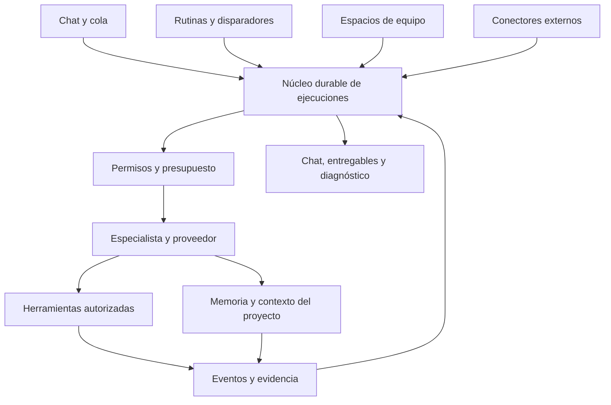

# Sparta Agent: auditoría funcional y oportunidades frente a OpenBot

**Fecha:** 2 de octubre de 2026.  
**Referencia local:** checkout `0aee1e27`, incluidos cambios sin confirmar.  
**Producto comparado:** [openbot.run](https://openbot.run/), cuyo repositorio enlazado es `nightly-labs/openbot`. No se usó el proyecto homónimo de CopilotKit como evidencia.

## 1. Decisión principal

Sparta ya tiene una base considerable de chat, proyectos, herramientas, permisos, memoria y automatizaciones. La mejor oportunidad es convertir esa base en **especialistas persistentes que trabajan sobre proyectos con control humano**, y después coordinarlos en equipos.

Los primeros cambios recomendados son:

1. Hacer que las pantallas indiquen capacidades reales: especialmente GitHub y Subagentes.
2. Guardar la cola y el estado de las ejecuciones de forma durable.
3. Añadir perfiles de especialistas reutilizando el chat actual.
4. Extender las automatizaciones existentes con contexto y herramientas autorizadas.
5. Construir colaboración entre especialistas después de tener recuperación y permisos por ejecución.

Cambiar únicamente los nombres de funciones no crea una mejora. Los nombres propuestos abajo acompañan diferencias concretas de comportamiento y alcance.

## 2. Método y nivel de certeza

Esta es una **auditoría estática del código y documentación**, contrastada con fuentes oficiales de OpenBot. No se instalaron proveedores, no se ejecutaron tareas con coste, no se conectaron cuentas y no se realizó una prueba integral de la aplicación nativa.

- **Conectada:** hay interfaz o acceso de usuario y lógica de ejecución/almacenamiento identificada. No equivale a certificación de funcionamiento en todos los entornos.
- **Parcial:** existe una base, pero faltan garantías o el alcance es menor que el nombre sugiere.
- **Ilustrativa:** la interfaz usa datos fijos sin demostrar una integración real.
- **Desactivada/heredada:** quedan archivos o rutas, pero no constituyen una función disponible en esta edición.
- **No localizada:** no encontré un flujo completo en las áreas examinadas. No afirmo que ningún archivo del repositorio pueda contener una pieza relacionada.

Se revisaron navegación y rutas, configuración, rail de trabajo, cola del chat, registro de herramientas, registro de routers del backend, memoria, automatizaciones, skills y autorización de proveedores. Las capturas de la landing no se usaron como prueba de capacidades del escritorio.

## 3. Qué funciones tienes actualmente y para qué sirven

| Función de Sparta | Para qué se utiliza | Estado observado | Evidencia |
| --- | --- | --- | --- |
| Chat por proveedores remotos | Preguntar, analizar y resolver tareas con el modelo elegido | Conectada en código | S1, S2 |
| Streaming y razonamiento | Leer la respuesta progresivamente y abrir el razonamiento disponible | Conectada | S2 |
| Detener y regenerar | Interrumpir una respuesta o iniciar otra ronda | Conectada | S2, S3 |
| Conversaciones y chat temporal | Organizar el historial o trabajar sin un chat normal persistente | Conectada en interfaz/runtime; la política de conservación merece prueba integral | S1, S2 |
| Proyectos y carpetas vinculadas | Dar a un chat un espacio de archivos y un contexto de trabajo | Conectada | S1, S4 |
| Explorador de archivos | Navegar el contenido de la carpeta autorizada | Conectada | S4 |
| Archivos y artefactos en el chat | Acceder a documentos o resultados asociados a una respuesta | Conectada | S4, S5 |
| Cambios y visor de diferencias | Revisar propuestas de edición | Parcial: hay visor, pero el tab Cambios monta FilesPanel en modo plano; no se debe asumir un flujo Git completo | S4 |
| Terminal y Python como herramientas | Ejecutar acciones o transformar datos dentro del alcance permitido | Herramientas registradas; disponibilidad depende de configuración y permisos | S6 |
| Edición de archivos | Aplicar cambios mediante herramientas | Herramienta registrada | S6 |
| Búsqueda web | Obtener información exterior como parte de una tarea | Herramienta registrada; depende de servicios/configuración | S6 |
| MCP y catálogo de conectores | Conectar herramientas externas y gestionar sus servidores | Conectada; contiene listado, catálogo, alta, modificación y prueba | S6, S7 |
| Skills instaladas y catálogo | Dar instrucciones reutilizables para tareas especializadas | Conectada: inventario y acciones de buscar, instalar, quitar y activar | S8 |
| Prompts guardados | Reutilizar solicitudes frecuentes | Ruta de backend y controles existentes | S9 |
| Cola de prompts | Enviar trabajo adicional mientras un chat está ocupado | Parcial: hay despacho secuencial, edición y reordenamiento; el gestor examinado mantiene runs en memoria | S3 |
| Memoria estructurada | Guardar hechos, preferencias y relaciones con ámbito de proyecto | Conectada: grafo, CRUD y herramientas de búsqueda/guardado | S10 |
| Extracción de memoria asistida | Convertir una fuente en propuestas de memoria revisables | Conectada; aceptación explícita y proveedor API; excluye conexiones de suscripción en ese endpoint | S10 |
| Automatizaciones programadas | Generar resultados de texto en fechas o intervalos | Conectada y limitada: intervalo, una vez o semanal; depende del backend abierto | S11 |
| Prueba manual de automatizaciones | Comprobar el resultado antes de activar una programación | Conectada; ejecución acotada y sin herramientas | S11 |
| Vista previa web/HTML | Ver una página o artefacto dentro de la interfaz | Parcial: BrowserPreviewPanel usa iframe, no un navegador nativo automatizable | S5 |
| GitHub en el rail | Mostrar información del repositorio | Ilustrativa: el panel examinado contiene commits y estado fijos | S4 |
| Subagentes en el rail | Presentar especialistas y su estado | Ilustrativa: lista fija de agentes; no demuestra un orquestador | S4 |
| Canales | Conversación compartida entre participantes | Próximamente: fila deshabilitada | S1 |
| Modelos y credenciales API | Elegir servicios y gestionar acceso | Conectada | S7, S12 |
| Autorización ChatGPT/Codex | Conectar un proveedor de tipo openai_codex mediante navegador o código de dispositivo | Implementación presente; no se validó inicio de sesión ni inferencia en esta auditoría | S12 |
| Monitor API | Observar actividad del servicio | Ruta y navegación presentes | S1 |
| Perfil, temas, fuentes, atajos y registros | Personalizar y diagnosticar el entorno | Conectada en configuración | S13 |
| Audio/modelos locales/agentes locales heredados | Funciones de otra superficie o edición | No contarlas como disponibles: audio redirige a chat y algunos tabs cargan un componente vacío | S13, S14 |
| Recetas de datos | Flujos heredados de preparación de datos | Ruta existente, excluida de navegación principal; funcionamiento no validado | S1, S14 |

### Hallazgos que cambian el plan

**Memoria y automatizaciones ya existen.** Conviene ampliarlas, no reconstruirlas con otro nombre. La automatización actual solo responde con el texto suministrado: `enabled_tools=[]`, `tools=[]`, `tool_choice="none"`. No puede prometer que revisó una carpeta o ejecutó pruebas.

**Las pantallas no siempre demuestran la función.** GitHub y Subagentes presentan datos estáticos en el componente auditado. Hasta conectarlos a un servicio, deberían indicar su condición de ejemplo o no mostrar estados como “sincronizado” y “disponible”.

**La documentación necesita reconciliación.** README describe inferencia API-only y excluye modelos locales; el código además contiene autorización de suscripción ChatGPT/Codex. Esto no prueba soporte comercial o compatibilidad total, pero sí impide describir la aplicación simplemente como “solo claves API”.

## 4. Qué ofrece OpenBot

Estos son resúmenes de capacidades declaradas o documentadas por el proyecto, no pruebas de ejecución realizadas aquí.

| Capacidad observada | Qué resuelve | Fuente |
| --- | --- | --- |
| Agentes persistentes y cambio de proveedor | Mantener identidad y continuidad del trabajo | O1 |
| Equipo de agentes y canales | Repartir tareas y compartir resultados | O2 |
| Cola durable y compactación | Continuidad en trabajos largos y reinicios | O2 |
| Navegador integrado y Computer Use | Interactuar con páginas y aplicaciones | O2 |
| Marketplace de agentes, plugins y skills | Descubrir e instalar capacidades reutilizables | O3 |
| Biblioteca local de skills con revisiones | Mantener procedimientos reutilizables | O2 |
| Rutinas y calendario | Programar y consultar actividad | O4 |
| Disparadores desde scripts locales | Reaccionar al fin de un proceso | O5 |
| Slack | Recibir trabajo desde conversaciones externas | O6 |
| Acceso desde web/móvil y servidores | Usar el host desde otros dispositivos | O7 |
| Tablas compartidas y publicación de sitios | Conservar datos estructurados y entregar resultados | O7 |
| Diagnóstico de proveedores | Entender conexión, catálogo y errores | O4 |

La comparación debe separar almacenamiento local de procesamiento: prompts y navegación pueden usar servicios remotos. No usar “todo permanece local” como promesa general de privacidad. [Fuente O1](https://openbot.run/).

## 5. Qué incorporar en Sparta, con nombres y mejoras propias

Las siguientes son **propuestas de diseño para Sparta**, no descripciones de funciones ya implementadas. P0 significa corregir fundamentos; P1 es la primera expansión; P2 depende de esos fundamentos; P3 puede esperar. Las complejidades son relativas, no estimaciones de calendario.

### F01. Centro de capacidades — P0, complejidad media

**Qué es:** un registro único que distingue disponible, desconectado, requiere configuración, desactivado y próximamente.  
**Para qué sirve:** evita botones que parecen operativos sin serlo y explica qué necesita el usuario para habilitarlos.  
**Qué reutilizar:** capabilities del workspace, catálogo de proveedores, catálogo MCP y registro de herramientas.  
**Mejora concreta:** rail, composer, configuración y documentación consultan la misma respuesta del backend. GitHub no afirma sincronización si no hizo una lectura real.  
**Criterio de aceptación:** cada control visible tiene una capacidad verificable y una explicación cuando está bloqueado.  
**Ejemplo:** “Navegador interactivo: todavía no disponible; Vista previa HTML: disponible”.

### F02. Bandeja de trabajo — P0, complejidad alta

**Relación con OpenBot:** su README describe una cola recuperable. [O2](https://github.com/nightly-labs/openbot).

**Qué es:** evolución durable de tu cola actual.  
**Para qué sirve:** recibir varias tareas, reordenarlas y recuperarlas tras cerrar la aplicación.  
**Qué reutilizar:** PromptQueueManager, contratos del chat e historial del backend.  
**Mejora concreta:** estados en base de datos: pendiente, preparada, ejecutándose, esperando aprobación, detenida, completada, fallida y resultado incierto. Cada entrada guarda modelo, permisos, proyecto y adjuntos al enviarse.  
**Criterio de aceptación:** reiniciar no pierde tareas; una ejecución de resultado desconocido requiere revisión antes de repetir una acción externa.  
**Ejemplo:** encolar analizar → corregir → probar; detener la segunda no elimina la tercera.

### F03. Especialistas — P1, complejidad alta

**Relación con OpenBot:** ofrece perfiles de agentes durables. [O1](https://openbot.run/).

**Qué es:** perfiles con nombre, función, instrucciones, proveedor, herramientas permitidas y proyecto.  
**Para qué sirve:** tener un revisor, investigador o asistente de documentos sin configurar todo en cada chat.  
**Qué reutilizar:** chat, prompts, skills, memoria, credenciales y proyectos.  
**Mejora concreta:** separar perfil de ejecución; cambiar el modelo no borra el perfil. Versionar instrucciones y mostrar diferencias antes de guardar. El perfil no obtiene permisos por llevar un nombre.  
**Criterio de aceptación:** crear, editar, duplicar y ejecutar un especialista con aislamiento de memoria y archivos.  
**Ejemplo:** “Revisor de Sparta” puede leer y proponer cambios; necesita aprobación para escribir.

### F04. Relevo de contexto — P1, complejidad alta

**Relación con OpenBot:** conserva el agente al cambiar de proveedor. [O1](https://openbot.run/).

**Qué es:** una transferencia explícita de objetivo, decisiones, pendientes, archivos y evidencia.  
**Para qué sirve:** cambiar de modelo o retomar una tarea larga sin empezar de cero.  
**Qué reutilizar:** historial y serialización de partes de mensaje; existe tratamiento específico de compactación Anthropic.  
**Mejora concreta:** normalizar un resumen independiente del proveedor, conservando las fuentes. No reenviar indiscriminadamente tokens internos de razonamiento o formatos privados de otro proveedor.  
**Criterio de aceptación:** el nuevo modelo ve qué está hecho y qué falta; si una herramienta no es compatible, se informa antes de continuar.  
**Ejemplo:** un modelo investiga y otro redacta usando las fuentes verificadas.

### F05. Memoria de proyecto — P1, complejidad media

**Qué es:** ampliación de tu grafo y de las herramientas memory_search/memory_save.  
**Para qué sirve:** recordar convenciones, decisiones y preferencias entre sesiones.  
**Qué reutilizar:** almacenamiento de memoria, ámbito del hilo, extracción y revisión existentes.  
**Mejora concreta:** guardar fuente, autor, fecha, confianza, ámbito y caducidad; permitir corregir o descartar recuerdos. Distinguir un hecho de una instrucción del usuario.  
**Criterio de aceptación:** la respuesta puede mostrar de dónde recuperó una decisión y el usuario puede borrarla.  
**Ejemplo:** “En este proyecto usamos npm y revisamos los cambios antes de aplicarlos”.  
**Límite importante:** memoria estructurada no equivale a RAG vectorial local; no hay que añadir embeddings solo por esta función.

### F06. Rutinas de proyecto — P1, complejidad alta

**Relación con OpenBot:** documenta rutinas y vista de calendario. [O4](https://openbot.run/changelog).

**Qué es:** evolución de Automatizaciones con proyecto, especialista y permisos capturados.  
**Para qué sirve:** ejecutar trabajo periódico, además de generar texto aislado.  
**Qué reutilizar:** scheduler, tareas guardadas, prueba manual, zona horaria y notificaciones actuales.  
**Mejora concreta:** comenzar por lectura de contexto; habilitar herramientas de escritura solo con política explícita. Mostrar próxima ejecución, último resultado, límite de gasto y errores consecutivos.  
**Criterio de aceptación:** pausar impide futuras ejecuciones; la rutina no ejecuta en masa horarios perdidos; una escritura exige el permiso previsto.  
**Ejemplo:** resumen semanal de cambios del proyecto.  
**Límite:** el scheduler actual depende de que el backend esté vivo; ejecución con la aplicación cerrada requiere un servicio independiente.

### F07. Disparadores locales — P2, complejidad media/alta

**Relación con OpenBot:** permite activar una rutina desde un script autorizado. [O5](https://github.com/nightly-labs/openbot/blob/main/docs/automation.md).

**Qué es:** eventos acotados que despiertan una rutina: pruebas terminadas, archivo cambiado o compilación fallida.  
**Para qué sirve:** conectar herramientas del proyecto sin sondeo constante.  
**Qué reutilizar:** API local y Rutinas de proyecto.  
**Mejora concreta:** autorización por tarea, caducidad, identificador de evento y deduplicación; no aceptar comandos arbitrarios en un payload.  
**Criterio de aceptación:** el mismo evento no genera dos ejecuciones y un origen no autorizado se rechaza.  
**Ejemplo:** “Cuando termine la compilación, resume los errores y prepara una propuesta”.

### F08. Navegador de trabajo — P1/P2, complejidad alta

**Relación con OpenBot:** su navegador tiene host propio y herramientas de interacción. [O7](https://github.com/nightly-labs/openbot/blob/main/docs/ARCHITECTURE.md).

**Qué es:** pestañas reales administradas por Electron con controles y herramientas del agente.  
**Para qué sirve:** investigar, verificar una interfaz, leer una página y ayudar en flujos web.  
**Qué reutilizar:** el rail y su estado visual; el iframe actual puede seguir sirviendo como preview de artefactos.  
**Mejora concreta:** separar vista previa, lectura de navegador e interacción con efectos externos. Incorporar dominios permitidos, sesión visible y toma de control del usuario.  
**Criterio de aceptación:** una página puede abrirse y leerse con evidencia; enviar un formulario aplica los permisos correspondientes.  
**Primera entrega:** navegador manual y lectura; después clic/escritura. No empezar con control general del sistema operativo.

### F09. Espacios de equipo — P2, complejidad muy alta

**Relación con OpenBot:** tiene canales con responsables y delegación. [O2](https://github.com/nightly-labs/openbot).

**Qué es:** conversaciones compartidas de especialistas alrededor de un objetivo.  
**Para qué sirve:** investigación, implementación y revisión en un mismo trabajo.  
**Qué reutilizar:** la entrada Canales, proyectos, Especialistas y Bandeja de trabajo.  
**Mejora concreta:** un responsable por tarea, roles visibles, subtareas, decisiones compartidas y límites de concurrencia. Delegar lectura no autoriza escribir en la misma carpeta.  
**Criterio de aceptación:** parar una tarea detiene sus subtareas; reasignar conserva el contexto y evita que dos agentes modifiquen el mismo recurso a la vez.  
**Ejemplo:** investigador entrega fuentes, implementador propone cambios y revisor comprueba el resultado.

### F10. Biblioteca de procedimientos — P1, complejidad media

**Relación con OpenBot:** tiene skills locales revisables e instalables. [O2](https://github.com/nightly-labs/openbot).

**Qué es:** interfaz propia sobre tus skills existentes, con búsqueda, vista previa, versiones y “Probar con este ejemplo”.  
**Para qué sirve:** convertir una tarea repetida en un procedimiento reutilizable.  
**Qué reutilizar:** inventario /api/skills y acciones de catálogo, instalación y activación.  
**Mejora concreta:** revisar instrucciones, requisitos y cambios de versión; proteger modificaciones locales. Probar añade un borrador, sin enviarlo automáticamente.  
**Criterio de aceptación:** actualizar permite comparar y revertir; habilitar una skill no instala ni ejecuta sus scripts automáticamente.  
**Ejemplo:** procedimiento para revisar una PR o preparar notas de versión.

### F11. Catálogo de soluciones — P2, complejidad alta

**Relación con OpenBot:** su marketplace separa agentes, plugins y skills. [O3](https://openbot.run/guides/openbot-marketplace).

**Qué es:** descubrimiento de Especialistas, Procedimientos y Conectores desde una sola pantalla.  
**Para qué sirve:** reducir la configuración inicial y mostrar qué capacidad se obtiene.  
**Qué reutilizar:** catálogos de skills y MCP antes de crear un servicio nuevo.  
**Mejora concreta:** cada ficha incluye propósito, permisos, proveedor necesario, ejemplo, versión y cómo desinstalar. Las plantillas no incluyen credenciales, recuerdos ni chats privados.  
**Criterio de aceptación:** instalar muestra exactamente qué se añadirá y las rutinas vienen desactivadas salvo elección explícita.  
**Ejemplo:** “Analista de documentos” instala un perfil y sus instrucciones, no archivos ajenos.

### F12. Conectores de trabajo — P1 para MCP; P3 para mensajería, complejidad alta

**Relación con OpenBot:** Slack entrega solicitudes a agentes y devuelve respuestas. [O6](https://github.com/nightly-labs/openbot/blob/main/docs/messaging.md).

**Qué es:** mejorar tus conexiones MCP y, más adelante, recibir tareas desde un canal externo.  
**Para qué sirve:** trabajar sobre GitHub, documentos o gestión de incidencias sin salir del flujo.  
**Qué reutilizar:** administración MCP, credenciales y políticas de herramientas.  
**Mejora concreta:** salud por conexión, permisos por proyecto, historial de uso y desconexión clara. Lectura y publicación son acciones distintas.  
**Criterio de aceptación:** un fallo explica qué cuenta o permiso falta; desconectar revoca el uso futuro.  
**Primera entrega:** un conector GitHub real de lectura. Slack espera a la recuperación y asignación de tareas.

### F13. Datos de trabajo — P2, complejidad media/alta

**Relación con OpenBot:** su arquitectura describe almacenamiento tabular compartido. [O7](https://github.com/nightly-labs/openbot/blob/main/docs/ARCHITECTURE.md).

**Qué es:** tablas de resultados de proyecto, independientes de la base interna de Sparta.  
**Para qué sirve:** conservar listas de incidencias, comparativas, inventarios o resultados de investigación.  
**Qué reutilizar:** artefactos, exportaciones y proyectos; no reutilizar tablas internas como base abierta al modelo.  
**Mejora concreta:** ámbito de proyecto, esquema visible, importación/exportación y cambios revisables.  
**Criterio de aceptación:** el agente puede consultar resultados autorizados sin poder modificar credenciales ni registros internos.  
**Ejemplo:** lista de funciones auditadas con estado, evidencia y prioridad.

### F14. Entregables de proyecto — P2, complejidad media

**Qué es:** reunir archivos generados, documentos y vistas HTML con su tarea de origen.  
**Para qué sirve:** encontrar el resultado terminado sin recorrer todo el chat.  
**Qué reutilizar:** artefactos y previews actuales.  
**Mejora concreta:** versiones, autor, fecha, archivos relacionados y acciones de abrir/exportar. Publicar a Internet sería una integración aparte y explícita.  
**Criterio de aceptación:** cada entregable tiene evidencia de generación y muestra si el archivo ya no está disponible.  
**Ejemplo:** informe Markdown, CSV y preview del mismo análisis, agrupados en una entrega.

### F15. Centro de diagnóstico — P0/P1, complejidad media

**Relación con OpenBot:** el changelog incluye diagnóstico específico de proveedores. [O4](https://openbot.run/changelog).

**Qué es:** una pantalla que explica estado de conexión, modelo, herramientas y ejecuciones fallidas.  
**Para qué sirve:** resolver “no funciona” sin adivinar ni inspeccionar secretos.  
**Qué reutilizar:** Monitor API, registros y estado de proveedores.  
**Mejora concreta:** diferenciar autenticación, cuota, modelo ausente, red y herramienta bloqueada. Exportar diagnóstico redactado, sin tokens ni contenido de conversación por defecto.  
**Criterio de aceptación:** cada error tiene causa y siguiente acción; reintentar no duplica una escritura incierta.  
**Ejemplo:** “El proveedor conecta, pero ya no lista el modelo seleccionado; elige otro”.

### F16. Acceso remoto a Sparta — P3, complejidad muy alta

**Relación con OpenBot:** tiene clientes web/móvil y acceso a hosts. [O7](https://github.com/nightly-labs/openbot/blob/main/docs/ARCHITECTURE.md).

**Qué es:** consultar y supervisar tu aplicación desde otro dispositivo.  
**Para qué sirve:** recibir una aprobación o ver un resultado cuando no estás ante el PC.  
**Qué reutilizar:** contratos de tareas, autenticación y eventos, una vez estabilizados.  
**Mejora concreta:** separar lectura, aprobación y administración; sesiones revocables y host claramente identificado.  
**Criterio de aceptación:** un cliente desconectado conserva su borrador, pero no repite una solicitud cuyo resultado desconoce.  
**No equivale:** poner la API local en una dirección pública. Necesita un diseño de acceso remoto propio.

### F17. Uso y presupuesto — P1, complejidad media

**Qué es:** mejora propia que reúne uso observado y límites por tarea, proyecto y proveedor.  
**Para qué sirve:** saber cuánto puede gastar una cola o rutina antes de activarla.  
**Qué reutilizar:** Monitor API y metadatos reales de respuesta cuando existan.  
**Mejora concreta:** distinguir consumo medido, estimación y valor desconocido; los límites de suscripción no deben inventarse a partir de tokens.  
**Criterio de aceptación:** el presupuesto detiene nuevos pasos cuando se alcanza el límite definido y muestra la causa.  
**Ejemplo:** ejecutar una rutina diaria con un máximo de llamadas y aviso al superar el umbral.

## 6. Qué puede servir para muchas funciones a la vez

La pieza transversal más útil es un **núcleo durable de ejecuciones**, no un agente que pueda hacerlo todo sin límites.

### Registro de ejecución común

Cada tarea debería guardar `runId`, objetivo, origen, propietario, proyecto, especialista, proveedor/modelo, permisos, estado, entradas, referencias de archivos, eventos, resultado y aprobación pendiente. Cola, rutina, canal o petición externa crean ejecuciones del mismo tipo.

**Qué desbloquea:** recuperación tras reinicio, cancelación, reintentos controlados, notificaciones, consumo, coordinación y auditoría. Si cada función crea su motor propio, esos comportamientos terminarán siendo distintos y difíciles de mantener.

### Conexiones útiles

| Combinación | Resultado práctico |
| --- | --- |
| Especialista + procedimiento + proyecto | Asistente reutilizable que conoce su responsabilidad |
| Memoria + relevo de contexto | Continuidad entre sesiones y proveedores |
| Bandeja + núcleo de ejecución | Trabajo recuperable y ordenado |
| Rutina + disparador local | Trabajo que reacciona al proyecto |
| Navegador + evidencia + permisos | Investigación verificable e interacción controlada |
| Equipo + bloqueos de recursos | Colaboración sin escrituras simultáneas incompatibles |
| Entregables + datos de trabajo | Resultados que pueden reutilizarse fuera del chat |
| Diagnóstico + presupuesto | Operación más comprensible y predecible |

## 7. Orden recomendado de implementación

| Fase | Trabajo | Condición para avanzar |
| --- | --- | --- |
| A: sinceridad y continuidad | F01, F15 y F02; reconciliar documentación | Estados reales, tareas durables y recuperación sin repetición ciega |
| B: asistentes reutilizables | F03, F04, F05 y F10 | Un especialista termina y retoma una tarea de proyecto |
| C: trabajo recurrente | F06, F07 y F17 | Rutina con contexto, política, resultado y límite verificables |
| D: herramientas y colaboración | F08, F09, F12 de lectura | Navegación con evidencia y delegación con recursos protegidos |
| E: distribución y resultados | F11, F13 y F14 | Instalación reversible y entregables trazables |
| F: acceso exterior | F16 y mensajería de F12 | Host autenticado, revocación y recuperación comprobadas |

No recomiendo empezar por una tienda pública, control total del escritorio o un cliente móvil. Son grandes expansiones mientras la cola y los estados de ejecución todavía necesitan una base durable.

## 8. Qué conservar y qué no incorporar ahora

- **Conservar:** React, Electron, backend existente, tema propio, proyectos, permisos, streaming y herramientas ya conectadas. No migrar a SolidJS solo porque OpenBot lo utiliza.
- **Conservar:** inferencia remota de la edición actual. Añadir un runtime de modelos locales sería una decisión de producto separada, con paquete y mantenimiento propios.
- **Mejorar:** llamadas externas y aprobaciones. No adoptar indiscriminadamente un modo de acceso amplio como valor predeterminado.
- **No duplicar:** Memoria, Automatizaciones, MCP y Skills con nuevas pantallas que hagan exactamente lo mismo.
- **No anunciar todavía:** equipo de agentes operativo, GitHub sincronizado, navegador autónomo o ejecución programada con herramientas.
- **No copiar identidad:** los nombres, instrucciones y flujos propuestos son propios de Sparta; cualquier reutilización concreta de código necesitaría revisar sus condiciones y dependencias.

## 9. Riesgos y preguntas que deben resolverse al implementar

1. **Recuperación:** una tarea puede haber escrito un archivo o enviado datos aunque el proceso haya perdido la confirmación. Un reintento no garantiza ejecución única.
2. **Concurrencia:** dos especialistas no deben editar el mismo recurso sin coordinación explícita.
3. **Ámbito:** memoria y archivos de un proyecto no se mezclan automáticamente con otros.
4. **Datos remotos:** mostrar proveedor y contenido que participará en una tarea, especialmente en rutinas.
5. **Capacidad del proveedor:** modelo compatible no implica herramientas, reasoning y compactación compatibles.
6. **Coste:** controlar pasos y llamadas, no confiar únicamente en un contador estimado de tokens.
7. **Dependencia del host:** una automatización de escritorio no funciona mientras su backend está cerrado.
8. **Certeza de la auditoría:** el checkout contiene cambios locales; el instalador publicado puede no incluirlos. Hace falta contrastar paquete y código antes de actualizar mensajes comerciales.

## 10. Evidencia local

Los enlaces apuntan a los archivos examinados. No se leyeron archivos de secretos para esta comparación.

| ID | Archivos y evidencia |
| --- | --- |
| S1 | [Router](D:/sparta-agent/desktop/frontend-spartan/src/app/router.tsx), [sidebar](D:/sparta-agent/desktop/frontend-spartan/src/components/app-sidebar.tsx): rutas, exclusiones y Canales deshabilitado |
| S2 | [ThreadWelcome](D:/sparta-agent/desktop/frontend-spartan/src/components/assistant-ui/thread/thread-welcome.tsx), [Reasoning](D:/sparta-agent/desktop/frontend-spartan/src/components/assistant-ui/reasoning.tsx), [proveedor externo](D:/sparta-agent/desktop/backend-spartan/core/inference/external_provider.py) |
| S3 | [Gestor de cola](D:/sparta-agent/desktop/frontend-spartan/src/components/assistant-ui/thread/prompt-queue-manager.ts), [tipos](D:/sparta-agent/desktop/frontend-spartan/src/components/assistant-ui/thread/prompt-queue-types.ts), [store UI](D:/sparta-agent/desktop/frontend-spartan/src/features/chat/stores/prompt-queue-ui-store.ts): Map en memoria y despacho |
| S4 | [Contenedor del rail](D:/sparta-agent/desktop/frontend-spartan/src/components/workspace-rail/workspace-panel-container.tsx), [FilesPanel](D:/sparta-agent/desktop/frontend-spartan/src/components/workspace-rail/files-panel.tsx), [DiffViewer](D:/sparta-agent/desktop/frontend-spartan/src/components/workspace-rail/diff-viewer.tsx), [rutas de archivos](D:/sparta-agent/desktop/backend-spartan/routes/project_files.py) |
| S5 | [BrowserPreviewPanel](D:/sparta-agent/desktop/frontend-spartan/src/components/workspace-rail/browser-preview-panel.tsx), [artefactos](D:/sparta-agent/desktop/frontend-spartan/src/features/chat/artifacts/artifact-surface.tsx): iframe y renderizado |
| S6 | [Registro de herramientas](D:/sparta-agent/desktop/backend-spartan/core/inference/tools.py): terminal, python, edit_file, web_search, render_html, MCP, memoria y skills |
| S7 | [MCP](D:/sparta-agent/desktop/backend-spartan/routes/mcp_servers.py), [proveedores](D:/sparta-agent/desktop/backend-spartan/routes/providers.py), [credenciales](D:/sparta-agent/desktop/backend-spartan/routes/provider_credentials.py) |
| S8 | [Skills API](D:/sparta-agent/desktop/backend-spartan/routes/skills.py), [acciones de skills](D:/sparta-agent/desktop/backend-spartan/core/inference/skill_actions.py), [cliente de inventario](D:/sparta-agent/desktop/frontend-spartan/src/features/chat/api/skills-api.ts) |
| S9 | [Prompts](D:/sparta-agent/desktop/backend-spartan/routes/prompts.py), [registro de routers](D:/sparta-agent/desktop/backend-spartan/main.py) |
| S10 | [Memoria UI](D:/sparta-agent/desktop/frontend-spartan/src/features/memory/memory-page.tsx), [rutas](D:/sparta-agent/desktop/backend-spartan/routes/memory.py), [acciones](D:/sparta-agent/desktop/backend-spartan/core/inference/memory_actions.py), [extracción](D:/sparta-agent/desktop/backend-spartan/core/inference/memory_extraction.py) |
| S11 | [Automatizaciones UI](D:/sparta-agent/desktop/frontend-spartan/src/features/tasks/automations-page.tsx), [rutas](D:/sparta-agent/desktop/backend-spartan/routes/tasks.py), [scheduler](D:/sparta-agent/desktop/backend-spartan/core/inference/task_scheduler.py), [ejecución acotada](D:/sparta-agent/desktop/backend-spartan/core/inference/task_preview.py) |
| S12 | [Autorización Codex](D:/sparta-agent/desktop/backend-spartan/routes/openai_codex_auth.py), [README](D:/sparta-agent/README.md) |
| S13 | [Configuración](D:/sparta-agent/desktop/frontend-spartan/src/features/settings/settings-dialog.tsx): tabs reales frente a ApiOnlyUnavailableTab |
| S14 | [Audio](D:/sparta-agent/desktop/frontend-spartan/src/app/routes/audio.tsx), [Export](D:/sparta-agent/desktop/frontend-spartan/src/app/routes/export.tsx), [Recetas](D:/sparta-agent/desktop/frontend-spartan/src/app/routes/data-recipes.tsx): redirecciones y ruta heredada |

## 11. Fuentes oficiales de OpenBot

- **O1:** [Sitio oficial](https://openbot.run/): orientación del producto, identidad de agentes y continuidad.
- **O2:** [Repositorio y README oficiales](https://github.com/nightly-labs/openbot): capacidades declaradas, biblioteca local y colas.
- **O3:** [Guía del marketplace](https://openbot.run/guides/openbot-marketplace): diferencias entre agentes, plugins y skills.
- **O4:** [Changelog oficial](https://openbot.run/changelog): rutinas, calendario y diagnóstico; última versión mostrada al consultar: 0.29.0, 2 de octubre de 2026.
- **O5:** [Automatización por scripts](https://github.com/nightly-labs/openbot/blob/main/docs/automation.md): disparadores locales autorizados.
- **O6:** [Conexiones de mensajería](https://github.com/nightly-labs/openbot/blob/main/docs/messaging.md): Slack y entrega de solicitudes.
- **O7:** [Arquitectura](https://github.com/nightly-labs/openbot/blob/main/docs/ARCHITECTURE.md): browser host, almacenamiento, colaboración y acceso remoto.

Las páginas y el branch main pueden cambiar. Este documento describe lo observado en la fecha indicada y propone el producto futuro de Sparta; no modifica la aplicación.
