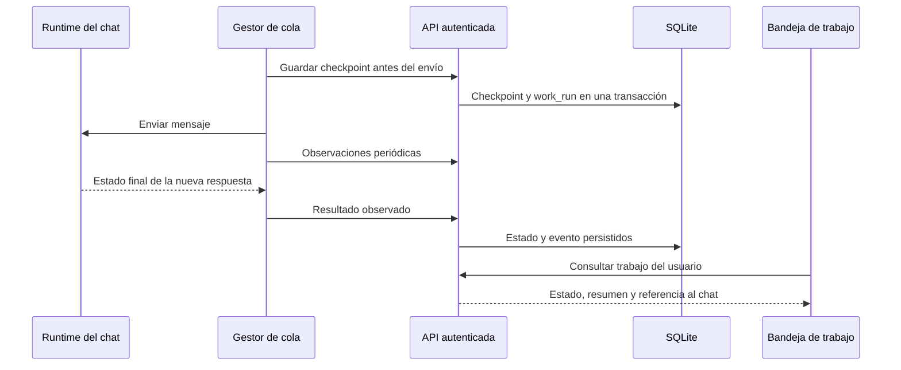

# Etapa 6: resultados de la cola y bandeja de trabajo

La sección Trabajo del escritorio reúne la Bandeja de trabajo y las Automatizaciones existentes. La bandeja consulta datos persistidos: no utiliza solicitudes de ejemplo. Incluye filtros por estado, búsqueda sobre la página actual, paginación, resumen del resultado y enlaces al chat.

## Flujo y responsabilidades

El runtime informa si la nueva respuesta terminó completa, con error, cancelada o incompleta. Que el chat deje de estar ocupado no demuestra éxito. Sin evidencia suficiente, el trabajo requiere revisión. Los resúmenes excluyen bloques de razonamiento y llamadas a herramientas, y tienen un máximo de 2.000 caracteres.

La proyección SQLite es atómica con el checkpoint. Los resultados terminales no pueden sobrescribirse. Las observaciones vencidas requieren revisión; una respuesta tardía puede aportar una confirmación posterior. El trabajador genérico no reclama solicitudes pertenecientes a la cola de un chat. El cierre de sesión cancela consultas y limpia la vista.

## Validación

- 48 pruebas existentes de checkpoints, almacenamiento de trabajo y API pasaron.
- 7 pruebas nuevas de proyección pasaron: estados observados, aislamiento por usuario, idempotencia, expiración, respuesta tardía, rollback ante sobrescritura y validación previa al envío.
- 13 pruebas del frontend pasaron: integración real del gestor de cola y clasificación de la nueva respuesta.
- Compilación de producción del frontend correcta. Mantiene avisos de tamaño de chunks e importaciones dinámicas del proyecto.

Las pruebas de Python se ejecutaron con `--noconftest`: la configuración global tiene una dependencia faltante, `core.inference.diffusion_prequant`, ajena a esta etapa. Esto no equivale a aprobar toda la suite.

## Límites y siguiente comprobación

El resultado es evidencia comunicada por el runtime; no verifica independientemente los efectos externos de las herramientas. La bandeja conserva un resumen y remite al chat para el contenido completo. La búsqueda y los filtros se aplican a los 100 registros de la página. El historial de eventos permanece disponible en la API; su visor visual queda pendiente.

Falta validar el recorrido completo en Electron con un proveedor real: enviar una cola, cancelar una respuesta, cerrar y reabrir la aplicación, recuperar pendientes y comprobar permisos. No se ha declarado aprobada esa comprobación nativa.
