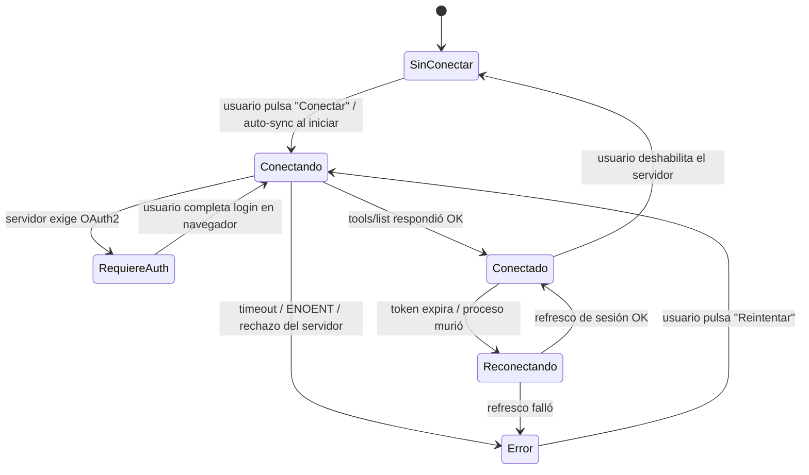

# 02 — Flujo UX de Conexión MCP (rediseño)

## Comparación: patrón actual de Sparta vs. patrón Claude/Anthropic

| Aspecto | Sparta Agent (actual) | Claude Desktop / claude.ai (referencia) |
|---|---|---|
| Agregar conector | Modal grande con tabs "Configuración manual / Importar JSON", muchos campos visibles a la vez | Tarjeta simple en un directorio, un botón "Conectar" |
| Verificación | Botón "Probar conexión" separado, manual | La verificación ocurre automáticamente al conectar, con spinner inline |
| Errores | Modal bloqueante con mensaje técnico crudo (`spawn npx ENOENT`) + botón de acción genérico | Mensaje corto y humano + una sola acción clara (reconectar / revisar permisos) |
| Estado "conectado" | Badge de texto ("Conectado"/"Desconectado") sin indicar actividad | Punto de color + ícono del servicio, siempre visible, sin necesidad de abrir nada |
| Actividad de la tool en el chat | No hay ningún indicador | Chip inline con el ícono del servicio + nombre de la acción, colapsa a "Listo ✔" al terminar |

---

## Máquina de estados propuesta para una card de servidor



### Puntos clave de este diseño:

- **`Conectando` es siempre visible como spinner inline en la card**, no en un modal aparte — así el usuario ve progreso sin tener que abrir nada, cumpliendo con la experiencia interactiva con feedback.
- **`RequiereAuth` es un estado explícito**, no un error. Debe abrir el navegador del sistema automáticamente y la card debe decir *"Esperando autenticación..."* en vez de fallar en silencio.
- **`Error` nunca reutiliza el botón "Instalar"** salvo que la causa real sea que falta descargar el paquete del servidor MCP. Para todo lo demás (ENOENT, timeout, 401, rechazo de conexión) el texto debe describir la causa en una frase y ofrecer **"Reintentar"**.
- El estado **`Conectado` solo se alcanza cuando hay un proceso/sesión respaldado por `McpProcessManager`** (ver documento 04) — es decir, deja de ser "conectado en el pasado durante una prueba" y pasa a ser "conectado ahora mismo".

---

## Copys sugeridos por estado

| Estado | Texto en la card | Color |
|---|---|---|
| Sin conectar | "Sin conectar" | Gris |
| Conectando | "Conectando…" (con spinner) | Ámbar |
| Requiere autenticación | "Esperando autenticación en el navegador…" | Ámbar |
| Conectado | "Conectado · N herramientas" | Verde |
| Reconectando | "Renovando sesión…" | Ámbar |
| Error | Causa corta, p.ej. "No se pudo iniciar el proceso (npx no encontrado)" | Rojo |

---

## Indicador de "MCP trabajando" dentro del chat

Actualmente, cuando el agente llama a una tool, el usuario no ve nada hasta que llega (o no) el resultado. Se propone un chip inline, similar al que usan Claude Desktop y Claude Code al mostrar el uso de una herramienta:

```
🔧  Usando Filesystem → list_directory("/proyectos")     [●●● animando]
```

Al completarse:

```
✅  Filesystem → list_directory("/proyectos")   Completado
```

Si falla:

```
⚠️  Filesystem → list_directory("/proyectos")   Error: permiso denegado
```

### Esqueleto ilustrativo del componente

```tsx
type McpToolCallStatus = 'running' | 'success' | 'error'

interface McpToolCallChipProps {
  serverIconSvg: string   // el ícono SVG propio del servidor (GitHub, Filesystem, etc.)
  serverName: string
  toolName: string
  status: McpToolCallStatus
  summary?: string        // ej. resultado corto o mensaje de error
}

function McpToolCallChip({ serverIconSvg, serverName, toolName, status, summary }: McpToolCallChipProps) {
  return (
    <div className={`mcp-chip mcp-chip--${status}`}>
      
      <span>{serverName} → {toolName}</span>
      {status === 'running' && <Spinner size="xs" />}
      {status === 'success' && <CheckIcon />}
      {status === 'error' && <WarnIcon />}
      {summary && <span className="mcp-chip-summary">{summary}</span>}
    </div>
  )
}
```

Este chip debe alimentarse de los eventos que ya existen en `mcp.handler.ts` (`mcp:tool_discovered`, etc.) más dos nuevos eventos emitidos desde el handler `mcp:call-tool` (ver documento 04): `mcp:tool_call_started` y `mcp:tool_call_finished`. Así el ícono SVG del servidor trabajando queda conectado directamente al ciclo de vida real de la llamada.
