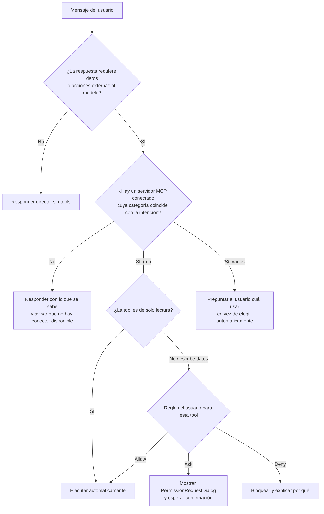

# 03 — Sistema de Reglas: cuándo usar un MCP y cuándo no

Hoy el agente no tiene ningún criterio: si hay una tool disponible, no queda claro si la llamará siempre, nunca, o al azar según el prompt. Esto hay que resolverlo en dos capas separadas, porque son decisiones distintas:

- **Capa 1 — Selección/enrutamiento:** ¿esta petición del usuario amerita usar *alguna* tool MCP, y si sí, cuál?
- **Capa 2 — Permisos/seguridad:** dado que se va a usar una tool concreta, ¿el usuario ya autorizó esa acción, o hay que preguntar primero?

Ahora mismo Sparta solo tiene el esqueleto de la Capa 2 (`mcp_permissions`, `PermissionRulesModal.tsx`) pero sin aplicarla en runtime (Brecha 6), y no tiene nada de la Capa 1.

---

## Capa 1 — Motor de selección (decisión antes de llamar cualquier tool)

Propuesta de flujo que debe correr en `agent-runtime.ts` antes de decidir si incluir/llamar una tool en el payload al LLM:



### Ideas clave de este flujo:

- **Coincidencia por categoría, no por "se parece".** Si el usuario pide "revisa mis issues" y hay un servidor de categoría `DevTools` conectado (GitHub), ese es el candidato correcto. No hay que inventar sub-categorías para justificar usar un servidor distinto "porque suena mejor" — eso es una preferencia de estilo, no un criterio real.
- **Nunca elegir automáticamente entre dos proveedores equivalentes.** Si el usuario tiene conectados tanto Google Drive como OneDrive, y pide "busca el documento X", no se debe asumir cuál usar — se pregunta.
- **Operaciones de escritura (`tools/call` que modifican estado) siempre pasan por la Capa 2**, incluso si la categoría matchea perfecto. Leer un archivo y borrar un archivo no deberían tener el mismo nivel de fricción.

---

## Capa 2 — Permisos por tool (el middleware que falta, Brecha 6)

### Modelo de datos propuesto

```typescript
type PermissionRule = 'allow' | 'ask' | 'deny'

interface McpToolPermission {
  serverId: string
  toolName: string          // '*' = aplica a todas las tools del server
  rule: PermissionRule
  scope: 'read' | 'write' | 'unknown'
}

// Persistido junto al resto de config de usuario, no en el Vault (no es secreto)
type McpPermissionsStore = McpToolPermission[]
```

---

### Reglas por defecto sugeridas

| Tipo de tool | Regla por defecto | Justificación |
|---|---|---|
| Lectura (`list`, `get`, `search`, `read`) | `allow` | Bajo riesgo, no modifica nada |
| Escritura (`create`, `update`, `delete`, `write`) | `ask` | El usuario debe confirmar antes de que se ejecute |
| Cualquier tool de un servidor recién conectado (primeras 24h) | `ask` | Periodo de "prueba" antes de otorgar confianza automática |
| Tool explícitamente marcada `deny` por el usuario | `deny` | Bloqueo duro, ni siquiera se muestra el diálogo |

---

### Dónde se aplica

El middleware debe interceptar **dentro del handler `mcp:call-tool`**, antes de invocar `mcpProcessManager.callTool(...)`:

```typescript
ipcMain.handle('mcp:call-tool', async (_event, { serverId, toolName, args }) => {
  const decision = await mcpPermissionsMiddleware.check(serverId, toolName)

  if (decision === 'deny') {
    throw new McpPermissionDeniedError(serverId, toolName)
  }

  if (decision === 'ask') {
    const approved = await requestUserPermission(serverId, toolName, args) // abre PermissionRequestDialog
    if (!approved) throw new McpPermissionDeniedError(serverId, toolName)
  }

  const serverConfig = await getMcpServerConfig(serverId)
  return await mcpProcessManager.callTool(serverConfig, toolName, args)
})
```

Así, la pieza de UI que ya existe (`PermissionRulesModal.tsx`) deja de ser decorativa y pasa a controlar de verdad lo que el agente puede o no ejecutar.
