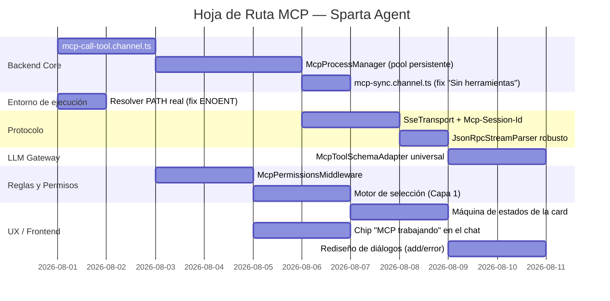

# 05 — Hoja de Ruta

Se mantiene el orden del plan original para el backend (es correcto: sin proceso persistente y sin handler de `call-tool`, nada más importa) y se agregan las dos fases nuevas de UX y reglas, que dependen de que el backend ya emita los eventos correctos.

---

## Orden recomendado y por qué

1. **`mcp-call-tool.channel.ts` + `McpProcessManager` primero:** Sin esto, nada de lo demás es observable ni probable en la práctica.
2. **Fix de PATH/ENOENT:** Puede ir en paralelo desde el día uno — es independiente y bloquea a cualquier usuario en entorno Electron sin shell heredado.
3. **`mcp-sync.channel.ts`:** Justo después del process manager — es el fix directo de "Desconectado"/"Sin herramientas".
4. **Reglas y permisos:** Pueden empezar en paralelo apenas exista el handler de `call-tool` (no dependen del transporte SSE).
5. **UX de la card:** Depende de que ya existan los 3 estados reales (`SinConectar` / `Conectando` / `Conectado` sostenido) — no tiene sentido rediseñar la card antes de que el estado subyacente sea confiable.
6. **Chip de "MCP trabajando":** Depende de los eventos `mcp:tool_call_started/finished`, que salen del middleware de permisos — por eso va después de `d1`.
7. **SSE y schema adapter:** Son importantes pero no bloquean la experiencia básica con servidores `stdio` (Filesystem, Git, Fetch, etc.), así que pueden ir en paralelo sin retrasar lo demás.

---

## Definition of Done (DoD) por fase

| Fase | Criterio de aceptación |
|---|---|
| **Backend Core** | Un servidor `stdio` conectado permanece "Conectado" tras cerrar y reabrir el modal de capacidades, y una tool se ejecuta desde el chat sin reiniciar el proceso. |
| **Entorno de ejecución** | El error `spawn npx ENOENT` no vuelve a aparecer en una instalación limpia con Node instalado vía nvm/volta o PATH de usuario. |
| **Protocolo** | Un servidor HTTP/SSE real (Notion o Supabase) completa `initialize` → `tools/list` → `tools/call` sin errores 404/405. |
| **Reglas y Permisos** | Una tool marcada "Denegar" nunca llega a `mcpProcessManager.callTool`, y una tool de escritura sin regla dispara el diálogo de confirmación. |
| **UX / Frontend** | La card nunca muestra "Desconectado" para un servidor con proceso activo, y toda llamada a tool desde el chat muestra el chip de actividad con el ícono del servidor. |
