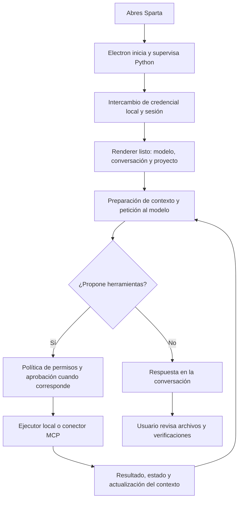

# Revisión del sistema y documentación

Fecha: 6 de septiembre de 2026. Estado: mejoras locales verificadas; la auditoría integral sigue abierta. Este informe distingue revisión de código, pruebas automatizadas y comprobaciones reales de navegador. No certifica inferencia, GPU, instaladores ni servicios externos.

## Resultado

Se corrigió la deduplicación para permitir consultar, modificar y volver a consultar el mismo recurso. Se clasificó la suite completa disponible, sin borrar ni desactivar casos. La documentación se reorganizó en 24 guías con Fumadocs, búsqueda local, navegación por secciones, índice del artículo, temas y enlaces entre páginas.

La documentación ahora describe Electron y Python, los límites entre ejecución local y proveedores remotos y los pasos de diagnóstico. Se retiraron afirmaciones generales de privacidad absoluta o aislamiento garantizado que el código revisado no permite sostener.

## Flujo actual

| Tramo | Cambio o hallazgo | Verificación pendiente |
|---|---|---|
| Arranque y sesión | Endurecimiento previo del intercambio entre Electron y backend; StartupGate espera autenticación | Arranque frío del instalador y recuperación después de terminar Python |
| Herramientas | La caché de resultados se invalida tras una posible mutación; mantiene protección contra bucles y acciones de una sola ejecución | Tarea larga contra un modelo real y reconexión de MCP |
| Terminal | Comando y aprobación visibles en los cambios previos | Cancelación, procesos hijos y semántica de terminal interactiva |
| Conversación y preferencias | Suite extensa, pero algunos contratos son anteriores a la migración | Revisar los seis resultados clasificados como diferencias de comportamiento |
| Persistencia | Debe validarse con datos reales controlados | Exportación, restauración, actualización y desinstalación conservando datos |
| Documentación | 24 páginas MDX cargadas individualmente; navegación y búsqueda verificadas en navegador | SEO con prerender y publicación real |

## Deduplicación

La identidad de una llamada no basta para reutilizar su resultado: una escritura, un comando o una herramienta externa puede haber cambiado el recurso. El controlador ahora conserva una revisión del workspace y limpia los resultados reutilizables ante acciones potencialmente mutantes, incluso si devuelven error porque pueden haber cambiado parcialmente el estado. Una observación anterior no se vuelve a introducir en caché después de una revisión nueva.

Las herramientas clasificadas explícitamente como consultas pueden reutilizar resultados dentro de la misma revisión. Las acciones desconocidas se tratan conservadoramente. Esto conserva eficiencia entre lecturas equivalentes y permite leer–editar–releer. No equivale a coordinación transaccional entre procesos externos.

## Evidencia de pruebas

| Comprobación | Resultado |
|---|---|
| Controlador de herramientas Python, ejecución aislada | 30 aprobadas |
| Suite completa frontend | 3.487 resultados: 3.321 aprobados, 166 fallidos, ninguno omitido |
| Comparación con primera ejecución frontend | 9 fallos resueltos en compatibilidad del portapapeles |
| Colección completa backend | 23.462 pruebas recogidas y 224 errores de colección; no constituye ejecución completa |
| Catálogo de documentación | 24 páginas, 16 enlaces internos en contenido y navegación completa |
| TypeScript y build de landing | Aprobados con React 19 |
| Navegador, build de producción | Las 24 páginas muestran su título y contenido; búsqueda sin acentos abre la guía correcta; menú móvil, cambio de tema y regreso a la portada comprobados |

El [informe de suites](audit/suite-classification.md) y su [JSON](audit/suite-classification.json) conservan evidencia por fallo. El clasificador comprueba que el número de registros coincide con el total de errores. Las categorías son una primera clasificación técnica, no una justificación automática para cambiar expectativas.

En backend aparecen dependencias ausentes del perfil CPU y errores de imports con módulos de ubicación desconocida. Estos últimos requieren revisar el aislamiento de stubs globales antes de atribuir todos los errores a instalaciones faltantes. Instalar PyTorch no resuelve por sí solo una suite contaminada por mocks.

## Diseño de documentación

Se utilizó `npm create fumadocs-app` para generar una referencia de React Router SPA fuera del proyecto. La integración conserva la landing existente y usa los componentes reales de Fumadocs: sidebar, artículos, tabla de contenidos, tarjetas, llamadas de atención y diálogo de búsqueda.

La estructura prioriza tareas: empezar, trabajar con archivos, investigar, conectar herramientas y diagnosticar. La paleta oscura neutra con acento amarillo tenue sigue la referencia del usuario. El CSS de documentación restaura la escala de espaciado necesaria sin trasladar las medidas de marketing al texto de lectura.

La comprobación de navegador encontró una incompatibilidad real: el proveedor del índice de contenidos usaba la sintaxis de contexto de React 19 sobre React 18. Se actualizaron React, React DOM y sus tipos en la landing y se repitió el build y la carga de páginas. La guía oficial explica la [migración a React 19](https://react.dev/blog/2024/04/25/react-19-upgrade-guide).

Las URL `?docs=…` permiten abrir y recargar artículos en un hosting estático sin reglas de reescritura. Se preservan alias anteriores. El buscador funciona con el catálogo local y normaliza acentos. La validación del catálogo se añadió al flujo de compilación del sitio en CI.

La decisión de usar componentes oficiales y una SPA sigue la [introducción de Fumadocs](https://www.fumadocs.dev/docs), sus [layouts de documentación](https://www.fumadocs.dev/docs/ui/layouts/docs) y las [opciones de despliegue estático](https://www.fumadocs.dev/docs/deploying/static). La búsqueda actual devuelve páginas, no resultados por cada párrafo; para un corpus mayor conviene indexar secciones.

## Rendimiento

La landing de marketing y la documentación ahora tienen entradas diferidas independientes. Abrir una guía no necesita montar las animaciones del sitio comercial. Cada MDX se importa al abrir su página; el diálogo de búsqueda tiene su propia carga y límite de Suspense para no ocultar toda la página mientras llega.

Medición del build de producción local, tamaños de archivos JavaScript sin comprimir y gzip estimado por Vite:

| Archivo | Tamaño | Gzip |
|---|---:|---:|
| Entrada compartida | ~233 kB | ~75 kB |
| Documentación | ~198 kB | ~68 kB |
| Marketing | ~208 kB | ~62 kB |

No son el total transferido de una ruta: hay CSS y dependencias compartidas adicionales. Tampoco demuestran un porcentaje de mejora en tiempo de arranque. La mejora comprobable es la separación de carga; falta medir tiempos con caché fría y hardware representativo.

Para el escritorio, la revisión previa del build detectó chunks grandes y dependencias circulares. El renderizador Markdown sigue importando plugins pesados estáticamente aunque decide si los usa según el contenido. La siguiente optimización debería separar carga de Mermaid, resaltado y matemáticas con pruebas de renderizado progresivo y manejo de errores. No se ha atribuido una reducción de latencia al escritorio sin medirla.

La [guía oficial de rendimiento de Electron](https://www.electronjs.org/docs/latest/tutorial/performance) recomienda medir y reducir trabajo de arranque. Medir por separado: inicio de proceso, primera ventana, backend listo, sesión lista, primer token y duración de herramientas. Reducir el bundle no acelera por sí solo la inferencia de un modelo ni la conexión de un proveedor remoto.

## Dependencias y trabajo siguiente

`npm audit` de la landing reportó cuatro entradas de severidad alta relacionadas con Fumadocs y su dependencia transitiva `image-size`. El problema informado es denegación de servicio al analizar imágenes, no evidencia de una explotación observada en esta aplicación. El arreglo sugerido requiere una actualización mayor de Fumadocs; queda pendiente migrarla con pruebas de MDX y navegación. Referencia del aviso: [analizador ICNS](https://github.com/advisories/GHSA-w3rx-r6r6-pgpr). No se ejecutó una actualización forzada que pudiera romper la integración.

Orden de trabajo pendiente:

1. Adaptar los contratos válidos de las 166 pruebas fallidas y aislar los módulos de pruebas del backend. Conectar los perfiles fiables al CI.
2. Probar arranque, reinicio, cancelación y cierre de procesos con Electron completo.
3. Medir y diferir los módulos pesados del escritorio conservando respuestas, código, fórmulas y diagramas.
4. Actualizar el conjunto Fumadocs a versiones que resuelvan el aviso transitivo y repetir las pruebas visuales.
5. Verificar exportación/restauración y conservación de datos antes de ampliar automatización, checkpoints o tareas reanudables.

No todo el sistema está todavía comprobado. Los cambios y sus límites quedan documentados para continuar con evidencia, sin confundir una compilación correcta con una aplicación completamente validada.
