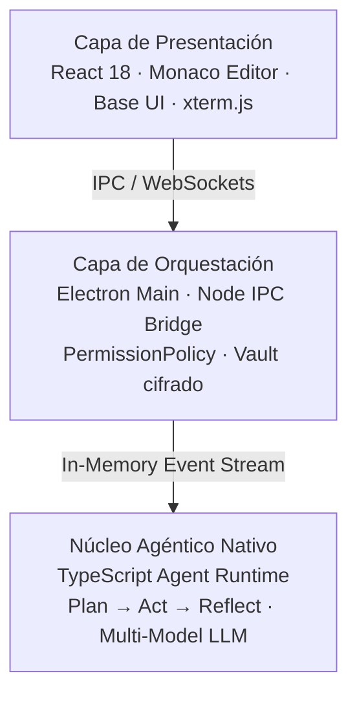
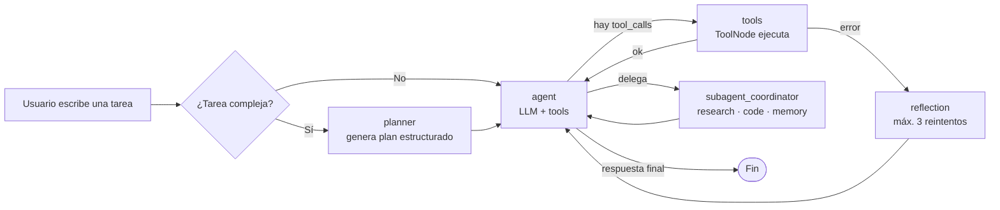

# Plan Maestro — Landing Page de Sparta Agent

> Documento de planificación. Vive en `landing/PLAN-LANDING.md`, en la raíz del proyecto, junto a la carpeta `landing/` donde construiremos el sitio. Antes de escribir una sola línea de código de la landing, este documento fija **qué vamos a construir, con qué stack, con qué contenido y en qué orden**.

---

## 1. Análisis del proyecto (lo que ya leí del repo)

Cloné y revisé `https://github.com/Naiker12/Sparta-Agent.git` a fondo: `README.md`, `package.json`, `components.json`, `docs/*.txt`, el design system (`desktop/ia-sparta-core/src/styles/base.css`) y los assets de `public/`. Esto es lo que importa para la landing:

**Qué es Sparta Agent.** Un IDE agéntico *local-first*: Electron + React 18 + Base UI + TypeScript en el frontend, y un motor agéntico nativo en TypeScript ejecutable en Node.js. No es un autocompletado — es un agente que planifica, ejecuta y se corrige a sí mismo.

**Los 3 argumentos de venta reales (no inventados, están en el README):**
1. **Privacidad/Compliance** — el código nunca sale del perímetro corporativo; procesamiento local-first, cumple GDPR/CCPA.
2. **Costo y flexibilidad de modelos** — mezcla modelos locales (Ollama/Llama 3) con modelos cloud premium (Anthropic, Gemini) según la tarea; hasta 70% menos TCO.
3. **Autonomía real** — ciclo Plan → Ejecuta → Reflexiona, no sugerencias línea por línea.

**Arquitectura (3 capas, ya documentada en el README):**


**El flujo del agente (de `docs/05-agentes.txt`, este es el corazón de la landing):**

Puntos clave a comunicar: máx. 8 tool calls por turno, subagentes con profundidad ≤ 2 y timeout de 120s, y **todo el plan es visible para el usuario en tiempo real** — nada ocurre "a ciegas".

**Seguridad (Security Matrix, también real, no cosmética):**
- `PermissionPolicy`: modos **PLAN** (solo lectura) y **BUILD** (escritura autorizada).
- `CommandSanitizer`: bloquea comandos destructivos (`rm -rf /`, `dd`, descargas no verificadas).
- `PathGuard & Denylist`: el agente no puede tocar `.env`, `.pem` ni salir del workspace.

**Stack ya usado en el proyecto (la landing debe sentirse de la misma familia, no de otra app):**
| Categoría | Librería |
|---|---|
| Framework | React 18 + TypeScript 5 + Vite |
| Estilos | Tailwind CSS v4 (`@tailwindcss/vite`) |
| Componentes | `shadcn/ui` — estilo **`base-nova`**, base color **`neutral`**, iconos **`lucide-react`** |
| Animación | `framer-motion` |
| Temas | `next-themes` |
| Tipografía | Inter (UI), Space Grotesk (display), Geist Variable (mono/código) |
| Gestor de paquetes | `pnpm` (monorepo con `pnpm-workspace.yaml`) |

**Paleta real del proyecto** (extraída de `base.css`, no inventada — esto es literalmente lo que ya usa la app):

| Token | Oscuro (default) | Claro (`[data-theme="light"]`) |
|---|---|---|
| `--bg-base` | `#0C0C10` | `#F4F4F7` |
| `--bg-surface` | `#131318` | `#F8F8FB` |
| `--bg-elevated` | `#1A1A22` | `#FFFFFF` |
| `--text-display` | `#F4F4F5` | `#0C0C18` |
| `--text-secondary` | `#A1A1AA` | `#3D4147` |
| `--accent` (marca) | `#6366F1` (indigo) | `#6366F1` |
| `--status-ok / warn / err / think` | `#22C55E / #F59E0B / #EF4444 / #A78BFA` | igual |
| `--border-normal` | `rgba(255,255,255,.09)` | `rgba(0,0,0,.12)` |
| Fuentes | Inter / Space Grotesk / Geist Variable | igual |

Esto **no lo vamos a reinventar**: la landing hereda estos tokens 1:1 mapeados a variables de shadcn (`--background`, `--foreground`, `--primary`, etc.), para que el sitio de marketing y la app se vean como el mismo producto.

**Assets que ya existen en `public/` y vamos a reutilizar** (no hay que generar arte nuevo desde cero):
- `post.png` — banner ya diseñado con el mockup de la app y el copy "AI Development, Uncompromised" → sirve de referencia directa para el Hero y como OG image.
- `sparta-escritorio.png` / `escritorio.png` — capturas reales de la app (panel de chat, editor Monaco, terminal) → sección "Showcase".
- `readmin.png` — ya trae iconos de los 4 pilares (Local-First Security, Multi-Model Flexibility, Autonomous Execution, Enterprise-Ready) → referencia directa para la sección de features.
- `blanco/Sparta Agent.png` y logos en `blanco/` / `negro/` → logo adaptativo para navbar según tema claro/oscuro.
- `favicon.svg`, `web-app-manifest-*.png` → ya listos, se reutilizan tal cual.

---

## 2. Objetivo de la landing

Un sitio de marketing **separado de la app** (la app monta en `index.html` → `desktop/ia-sparta-app-shell`), que:
1. Explique en 5 segundos qué es Sparta Agent y por qué es distinto a un Copilot pasivo.
2. Muestre el flujo del agente de forma visual (el diagrama de arriba, animado paso a paso — este es el **elemento signature** del sitio).
3. Convierta: botones claros a **GitHub** (estrella/clonar) y a **Quick Start**.
4. Tenga modo claro y oscuro real, no cosmético, usando los mismos tokens de la app.

---

## 3. Dónde vive y cómo se integra al monorepo

Se crea como **paquete nuevo del workspace pnpm**, sin tocar nada de `desktop/*`:

```
Sparta-Agent/
├── landing/                          ← NUEVO
│   ├── PLAN-LANDING.md               ← este documento
│   ├── package.json
│   ├── vite.config.ts
│   ├── index.html
│   ├── tsconfig.json
│   ├── components.json               (copia adaptada del de la raíz: style "base-nova", baseColor "neutral")
│   ├── public/                        (symlink lógico / copia selectiva de assets reales: post.png, sparta-escritorio.png, escritorio.png, readmin.png, blanco/, negro/, favicon.*)
│   └── src/
│       ├── main.tsx
│       ├── App.tsx
│       ├── styles/
│       │   └── globals.css            (tokens claro/oscuro migrados desde desktop/ia-sparta-core/src/styles/base.css)
│       ├── components/
│       │   ├── ui/                    (componentes shadcn generados: button, badge, card, tabs, accordion, sheet, separator, tooltip, navigation-menu)
│       │   ├── theme-provider.tsx
│       │   ├── theme-toggle.tsx
│       │   └── sections/
│       │       ├── navbar.tsx
│       │       ├── hero.tsx
│       │       ├── trust-bar.tsx
│       │       ├── value-props.tsx
│       │       ├── agent-flow.tsx     ← pieza central / signature
│       │       ├── architecture.tsx
│       │       ├── features-grid.tsx
│       │       ├── security-matrix.tsx
│       │       ├── skills-ecosystem.tsx
│       │       ├── showcase.tsx
│       │       ├── roadmap.tsx
│       │       ├── quick-start.tsx
│       │       ├── cta.tsx
│       │       └── footer.tsx
│       └── lib/
│           └── utils.ts               (cn helper, igual convención que el resto del monorepo)
└── pnpm-workspace.yaml                ← se le agrega 'landing'
```

Cambio necesario en `pnpm-workspace.yaml`:
```yaml
packages:
  - 'landing'
  - 'desktop/ia-sparta-app-shell'
  # ...resto igual
```

Scripts que se agregan al `package.json` raíz (opcional, para comodidad):
```json
"landing:dev": "pnpm --filter landing dev",
"landing:build": "pnpm --filter landing build"
```

La landing corre y se despliega **de forma completamente independiente** de la app de escritorio (no depende de Electron, Python ni Rust). Esto la hace desplegable en Vercel/Netlify en minutos.

---

## 4. Sistema de diseño de la landing (heredado, no nuevo)

- **Tipografía:** Space Grotesk 700 para titulares (misma fuente "display" que ya usa la app — le da identidad sin inventar nada nuevo), Inter 400/500/600 para cuerpo, Geist Variable Mono para fragmentos de código y el diagrama del flujo del agente.
- **Color:** los mismos tokens de `base.css`, remapeados a las variables que espera shadcn (`--background`, `--foreground`, `--primary`, `--muted`, `--border`, `--ring`, etc.), en `:root` (oscuro, porque **el oscuro es el tema por defecto de la app real** — la landing respeta esa decisión de producto) y `.light` para el claro.
- **Acento único:** indigo `#6366F1`. No se agregan gradientes genéricos tipo "IA" — el acento se usa con disciplina: bordes activos, el nodo "agent" del diagrama de flujo, y CTAs primarios. Nada más.
- **Radios:** se respetan los ya definidos (`--radius-sm: 3px` → `--radius-xl: 14px`), look "IDE profesional", no redondeos exagerados tipo SaaS genérico.
- **Elemento signature del sitio:** el diagrama del **flujo del agente** (sección 3 más abajo) animado con `framer-motion`, donde los nodos se iluminan en secuencia (planner → agent → tools → reflection) como si el usuario viera al agente "pensar" en vivo. Es el único momento con animación elaborada; el resto del sitio se mantiene disciplinado (fade/slide-in sutil al hacer scroll, nada más).

---

## 5. Estructura de secciones (contenido real, adaptado del README — no relleno genérico)

| # | Sección | Contenido |
|---|---|---|
| 1 | **Navbar** | Logo adaptativo (`blanco/negro` según tema), enlaces a secciones, toggle claro/oscuro (`next-themes`), botón "Ver en GitHub" |
| 2 | **Hero** | Titular: *"Un IDE agéntico que planifica, ejecuta y se corrige. Sin que tu código salga de tu máquina."* Subtítulo con la propuesta de valor local-first. CTAs: "Empezar" (→ quick start) y "Ver en GitHub". Al lado, mockup real basado en `sparta-escritorio.png` |
| 3 | **Trust bar** | Badges del stack real: React 18 · TypeScript 5 · Electron 30 · Python 3.11 · Rust 1.85 · LangGraph — los mismos badges que ya están en el README, con logos vía `lucide-react`/simple-icons |
| 4 | **Propuesta de valor** | Los 3 pilares reales del README: Compliance/IP, Costo/TCO -70%, Autonomía real — en cards con `Tabs` o `Accordion` de shadcn |
| 5 | **Cómo funciona (Agent Flow)** — signature | El diagrama `planner → agent → tools ⇄ reflection → subagent_coordinator → END`, animado paso a paso, con leyenda de límites reales (máx. 8 tool calls/turno, subagentes profundidad ≤2, timeout 120s) |
| 6 | **Arquitectura** | Las 3 capas (Presentación / Orquestación / Núcleo de Inteligencia) en diagrama vertical con `Card` |
| 7 | **Pilares del producto** | `create_plan` transparente · Sandbox + Broker de permisos · Diagnósticos continuos (`tsc`, `eslint`, `ruff`, `mypy`, `cargo`) · Ecosistema MCP — grid de 4 `Card` con iconos `lucide-react` |
| 8 | **Seguridad** | Security Matrix: `PermissionPolicy` (PLAN/BUILD) · `CommandSanitizer` · `PathGuard & Denylist` |
| 9 | **Ecosistema de Skills** | Las categorías reales que ya existen en `/skills` del repo (coding, research, automation, data-science, productivity, github, social-media, mlops, etc.) como chips/badges — comunica extensibilidad |
| 10 | **Showcase** | Galería con `sparta-escritorio.png`, `escritorio.png`, `readmin.png` en un carrusel/tabs simple |
| 11 | **Roadmap** | Logrado vs. en desarrollo, tomado 1:1 del README (checklist visual) |
| 12 | **Quick Start** | Los 3 comandos reales del README (`pnpm install && pnpm sidecar:setup`, `pnpm rust:napi`, `pnpm dev`) en un bloque de código con botón copiar |
| 13 | **CTA final** | "Clona el repo, corre `pnpm dev`, y mira al agente planificar su primera tarea." + botón GitHub |
| 14 | **Footer** | Licencia MIT, autor (Naiker12), enlaces a `docs/`, `SECURITY.md` |

---

## 6. Componentes de shadcn/ui a instalar

Usando el `components.json` ya existente en el proyecto (`style: base-nova`, `baseColor: neutral`, `iconLibrary: lucide`) como base para el de `landing/`:

```bash
npx shadcn add button badge card separator tabs accordion tooltip navigation-menu sheet
```
(`button` y `dialog` ya existen como referencia en `components/ui/` de la raíz — se replica el mismo patrón de estilo).

---

## 7. Modo claro/oscuro

- `next-themes` con `attribute="class"`, `defaultTheme="dark"` (coherente con la app), `enableSystem`.
- El logo del navbar cambia entre `blanco/Sparta Agent.png` (tema oscuro) y su equivalente en `negro/` (tema claro) — igual que ya resuelve la app con la variable `--invert-logo`.
- Toggle en el navbar con icono `Sun`/`Moon` de `lucide-react` y transición suave de color (`transition-colors`).

---

## 8. Responsive, accesibilidad y performance

- Mobile-first; el diagrama de flujo del agente colapsa a layout vertical en `<768px`.
- Foco visible en todos los elementos interactivos (`--border-focus` ya definido en el design system).
- `prefers-reduced-motion` respetado: la animación del diagrama se vuelve estática si el usuario lo prefiere.
- Imágenes reales (`sparta-escritorio.png` pesa ~635KB) se optimizan/comprimen y se cargan con `loading="lazy"` fuera del viewport inicial.
- Meta tags + Open Graph usando `post.png` como imagen social (ya tiene el diseño correcto para eso).

---

## 9. Plan de trabajo por fases

- **Fase 0 — Scaffold:** crear `landing/` como paquete pnpm (Vite + React + TS + Tailwind v4), registrar en `pnpm-workspace.yaml`, instalar shadcn con la misma config.
- **Fase 1 — Tokens y layout base:** migrar paleta claro/oscuro, tipografías, `theme-provider`, layout de navbar/footer.
- **Fase 2 — Secciones estáticas:** Hero, Trust bar, Propuesta de valor, Arquitectura, Pilares, Seguridad, Skills, Showcase, Roadmap, Quick Start, CTA — con el copy ya definido en la sección 5.
- **Fase 3 — Signature interactivo:** diagrama animado del flujo del agente con `framer-motion`.
- **Fase 4 — Pulido:** responsive, accesibilidad, `prefers-reduced-motion`, SEO/OG.
- **Fase 5 — Deploy:** build estático (`pnpm --filter landing build`) → Vercel/Netlify, dominio propio.

---

## 10. Siguiente paso inmediato

Con este plan aprobado, el siguiente mensaje debería ser: *"dale, empieza con la Fase 0 y 1"* — y a partir de ahí genero el scaffold real del paquete `landing/` (código, no solo plan) siguiendo exactamente esta estructura y estos tokens.
